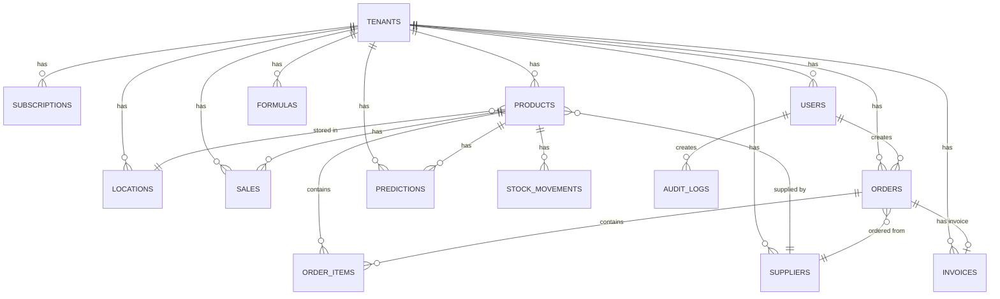

# FlowStock Database Schema Documentation

## Introduction

This document defines the complete PostgreSQL database schema for FlowStock SaaS, implementing a multi-tenant architecture with row-level security. The schema supports all 35 user stories across 7 epics defined in the PRD, with a focus on data isolation, performance, and scalability.

### Schema Version

| Version | Date | Description | Author |
|---------|------|-------------|--------|
| 1.0 | 2026-01-21 | Initial schema design | Winston (Architect) |

### Database Technology Stack

- **Primary Database**: PostgreSQL 15+ (Cloud SQL on GCP)
- **Time-Series Extension**: TimescaleDB for sales data
- **Connection Pooling**: PgBouncer (managed by Cloud SQL)
- **Backup Strategy**: Daily automated backups with 7-day retention

---

## Multi-Tenancy Strategy

### Approach: Row-Level Security (RLS)

**Rationale**: Row-level security provides strong data isolation while maintaining a single database instance, reducing operational complexity and costs for MVP.

**Implementation**:
- Every table (except `tenants`) includes a `tenant_id` column
- PostgreSQL RLS policies enforce tenant isolation at the database level
- Application sets `app.current_tenant` session variable on connection
- Automatic filtering prevents cross-tenant data access

**Alternative Considered**: Schema-per-tenant was rejected due to migration complexity and increased operational overhead.

---

## Core Entities

### 1. Tenants Table

**Purpose**: Foundation of multi-tenancy, represents each company/organization.

```sql
CREATE TABLE tenants (
    id UUID PRIMARY KEY DEFAULT gen_random_uuid(),
    company_name VARCHAR(255) NOT NULL,
    slug VARCHAR(100) UNIQUE NOT NULL, -- URL-friendly identifier
    industry VARCHAR(100), -- e.g., 'cafe', 'retail', 'ecommerce'
    created_at TIMESTAMP WITH TIME ZONE DEFAULT CURRENT_TIMESTAMP,
    updated_at TIMESTAMP WITH TIME ZONE DEFAULT CURRENT_TIMESTAMP,
    is_active BOOLEAN DEFAULT true,
    settings JSONB DEFAULT '{}', -- Tenant-specific configuration
    
    -- Constraints
    CONSTRAINT slug_format CHECK (slug ~ '^[a-z0-9-]+$')
);

-- Indexes
CREATE INDEX idx_tenants_slug ON tenants(slug);
CREATE INDEX idx_tenants_active ON tenants(is_active) WHERE is_active = true;
```

**Key Fields**:
- `slug`: Human-readable identifier for URLs (e.g., `cafe-paris-15`)
- `settings`: Flexible JSONB for tenant-specific config (timezone, currency, etc.)
- `is_active`: Soft delete mechanism

---

### 2. Subscriptions Table

**Purpose**: Manage subscription tiers (Normal, Premium, Premium Plus) and billing.

```sql
CREATE TYPE subscription_tier AS ENUM ('normal', 'premium', 'premium_plus');
CREATE TYPE subscription_status AS ENUM ('active', 'cancelled', 'past_due', 'trial');

CREATE TABLE subscriptions (
    id UUID PRIMARY KEY DEFAULT gen_random_uuid(),
    tenant_id UUID NOT NULL REFERENCES tenants(id) ON DELETE CASCADE,
    tier subscription_tier NOT NULL DEFAULT 'normal',
    status subscription_status NOT NULL DEFAULT 'trial',
    started_at TIMESTAMP WITH TIME ZONE DEFAULT CURRENT_TIMESTAMP,
    trial_ends_at TIMESTAMP WITH TIME ZONE,
    current_period_start TIMESTAMP WITH TIME ZONE,
    current_period_end TIMESTAMP WITH TIME ZONE,
    cancelled_at TIMESTAMP WITH TIME ZONE,
    price_monthly DECIMAL(10,2), -- Actual price paid (may differ from standard)
    stripe_subscription_id VARCHAR(255), -- External payment provider ID
    created_at TIMESTAMP WITH TIME ZONE DEFAULT CURRENT_TIMESTAMP,
    updated_at TIMESTAMP WITH TIME ZONE DEFAULT CURRENT_TIMESTAMP,
    
    -- Constraints
    CONSTRAINT one_active_subscription_per_tenant UNIQUE (tenant_id) 
        WHERE status = 'active'
);

-- Indexes
CREATE INDEX idx_subscriptions_tenant ON subscriptions(tenant_id);
CREATE INDEX idx_subscriptions_status ON subscriptions(status);
CREATE INDEX idx_subscriptions_stripe ON subscriptions(stripe_subscription_id);
```

**Key Features**:
- One active subscription per tenant enforced by partial unique index
- Trial period support with `trial_ends_at`
- Integration with Stripe via `stripe_subscription_id`

---

### 3. Users Table

**Purpose**: User authentication and authorization.

```sql
CREATE TYPE user_role AS ENUM ('owner', 'admin', 'user');

CREATE TABLE users (
    id UUID PRIMARY KEY DEFAULT gen_random_uuid(),
    tenant_id UUID NOT NULL REFERENCES tenants(id) ON DELETE CASCADE,
    email VARCHAR(255) NOT NULL,
    password_hash VARCHAR(255) NOT NULL, -- bcrypt hash
    first_name VARCHAR(100),
    last_name VARCHAR(100),
    role user_role NOT NULL DEFAULT 'user',
    is_active BOOLEAN DEFAULT true,
    email_verified BOOLEAN DEFAULT false,
    email_verified_at TIMESTAMP WITH TIME ZONE,
    last_login_at TIMESTAMP WITH TIME ZONE,
    created_at TIMESTAMP WITH TIME ZONE DEFAULT CURRENT_TIMESTAMP,
    updated_at TIMESTAMP WITH TIME ZONE DEFAULT CURRENT_TIMESTAMP,
    
    -- Constraints
    CONSTRAINT unique_email_per_tenant UNIQUE (tenant_id, email),
    CONSTRAINT email_format CHECK (email ~* '^[A-Za-z0-9._%+-]+@[A-Za-z0-9.-]+\.[A-Za-z]{2,}$')
);

-- Indexes
CREATE INDEX idx_users_tenant ON users(tenant_id);
CREATE INDEX idx_users_email ON users(email);
CREATE INDEX idx_users_active ON users(is_active) WHERE is_active = true;

-- RLS Policy
ALTER TABLE users ENABLE ROW LEVEL SECURITY;

CREATE POLICY tenant_isolation_policy ON users
    USING (tenant_id = current_setting('app.current_tenant')::UUID);
```

**Security Notes**:
- Passwords stored as bcrypt hashes (never plaintext)
- Email uniqueness scoped per tenant (same email can exist in different tenants)
- RLS policy ensures users only see users from their tenant

---

### 4. Locations Table

**Purpose**: Multi-warehouse/store support for inventory management.

```sql
CREATE TABLE locations (
    id UUID PRIMARY KEY DEFAULT gen_random_uuid(),
    tenant_id UUID NOT NULL REFERENCES tenants(id) ON DELETE CASCADE,
    name VARCHAR(255) NOT NULL,
    address TEXT,
    location_type VARCHAR(50), -- 'warehouse', 'store', 'online'
    is_active BOOLEAN DEFAULT true,
    created_at TIMESTAMP WITH TIME ZONE DEFAULT CURRENT_TIMESTAMP,
    updated_at TIMESTAMP WITH TIME ZONE DEFAULT CURRENT_TIMESTAMP,
    
    -- Constraints
    CONSTRAINT unique_location_name_per_tenant UNIQUE (tenant_id, name)
);

-- Indexes
CREATE INDEX idx_locations_tenant ON locations(tenant_id);
CREATE INDEX idx_locations_active ON locations(is_active) WHERE is_active = true;

-- RLS Policy
ALTER TABLE locations ENABLE ROW LEVEL SECURITY;
CREATE POLICY tenant_isolation_policy ON locations
    USING (tenant_id = current_setting('app.current_tenant')::UUID);
```

---

### 5. Suppliers Table

**Purpose**: Vendor management for purchase orders.

```sql
CREATE TABLE suppliers (
    id UUID PRIMARY KEY DEFAULT gen_random_uuid(),
    tenant_id UUID NOT NULL REFERENCES tenants(id) ON DELETE CASCADE,
    name VARCHAR(255) NOT NULL,
    contact_name VARCHAR(255),
    email VARCHAR(255),
    phone VARCHAR(50),
    address TEXT,
    notes TEXT,
    is_active BOOLEAN DEFAULT true,
    created_at TIMESTAMP WITH TIME ZONE DEFAULT CURRENT_TIMESTAMP,
    updated_at TIMESTAMP WITH TIME ZONE DEFAULT CURRENT_TIMESTAMP,
    
    -- Constraints
    CONSTRAINT unique_supplier_name_per_tenant UNIQUE (tenant_id, name)
);

-- Indexes
CREATE INDEX idx_suppliers_tenant ON suppliers(tenant_id);
CREATE INDEX idx_suppliers_active ON suppliers(is_active) WHERE is_active = true;

-- RLS Policy
ALTER TABLE suppliers ENABLE ROW LEVEL SECURITY;
CREATE POLICY tenant_isolation_policy ON suppliers
    USING (tenant_id = current_setting('app.current_tenant')::UUID);
```

---

### 6. Products Table

**Purpose**: Core inventory items with quantities and metadata.

```sql
CREATE TYPE product_unit AS ENUM ('piece', 'kg', 'liter', 'box', 'pack');

CREATE TABLE products (
    id UUID PRIMARY KEY DEFAULT gen_random_uuid(),
    tenant_id UUID NOT NULL REFERENCES tenants(id) ON DELETE CASCADE,
    sku VARCHAR(100) NOT NULL, -- Stock Keeping Unit
    name VARCHAR(255) NOT NULL,
    description TEXT,
    unit product_unit NOT NULL DEFAULT 'piece',
    quantity DECIMAL(10,2) NOT NULL DEFAULT 0,
    min_quantity DECIMAL(10,2) DEFAULT 0, -- Alert threshold
    location_id UUID REFERENCES locations(id) ON DELETE SET NULL,
    supplier_id UUID REFERENCES suppliers(id) ON DELETE SET NULL,
    purchase_price DECIMAL(10,2), -- Cost per unit
    selling_price DECIMAL(10,2), -- Retail price
    lead_time_days INTEGER DEFAULT 7, -- Supplier delivery time
    is_active BOOLEAN DEFAULT true,
    created_at TIMESTAMP WITH TIME ZONE DEFAULT CURRENT_TIMESTAMP,
    updated_at TIMESTAMP WITH TIME ZONE DEFAULT CURRENT_TIMESTAMP,
    
    -- Constraints
    CONSTRAINT unique_sku_per_tenant UNIQUE (tenant_id, sku),
    CONSTRAINT quantity_non_negative CHECK (quantity >= 0),
    CONSTRAINT min_quantity_non_negative CHECK (min_quantity >= 0),
    CONSTRAINT prices_non_negative CHECK (
        (purchase_price IS NULL OR purchase_price >= 0) AND
        (selling_price IS NULL OR selling_price >= 0)
    )
);

-- Indexes
CREATE INDEX idx_products_tenant ON products(tenant_id);
CREATE INDEX idx_products_sku ON products(tenant_id, sku);
CREATE INDEX idx_products_location ON products(location_id);
CREATE INDEX idx_products_supplier ON products(supplier_id);
CREATE INDEX idx_products_low_stock ON products(tenant_id) 
    WHERE quantity <= min_quantity AND is_active = true;

-- RLS Policy
ALTER TABLE products ENABLE ROW LEVEL SECURITY;
CREATE POLICY tenant_isolation_policy ON products
    USING (tenant_id = current_setting('app.current_tenant')::UUID);
```

**Key Features**:
- Flexible units (piece, kg, liter, etc.)
- Low stock index for efficient alert queries
- Soft delete with `is_active`

---

### 7. Stock Movements Table

**Purpose**: Complete audit trail of all inventory changes.

```sql
CREATE TYPE movement_type AS ENUM (
    'initial_stock',    -- Initial import
    'purchase',         -- Received from supplier
    'sale',             -- Sold to customer
    'adjustment',       -- Manual correction
    'transfer',         -- Between locations
    'return',           -- Customer return
    'loss'              -- Damaged/lost
);

CREATE TABLE stock_movements (
    id UUID PRIMARY KEY DEFAULT gen_random_uuid(),
    tenant_id UUID NOT NULL REFERENCES tenants(id) ON DELETE CASCADE,
    product_id UUID NOT NULL REFERENCES products(id) ON DELETE CASCADE,
    movement_type movement_type NOT NULL,
    quantity_change DECIMAL(10,2) NOT NULL, -- Positive or negative
    quantity_before DECIMAL(10,2) NOT NULL,
    quantity_after DECIMAL(10,2) NOT NULL,
    location_id UUID REFERENCES locations(id) ON DELETE SET NULL,
    user_id UUID REFERENCES users(id) ON DELETE SET NULL,
    reference_id UUID, -- Link to order/invoice/sale
    notes TEXT,
    created_at TIMESTAMP WITH TIME ZONE DEFAULT CURRENT_TIMESTAMP,
    
    -- Constraints
    CONSTRAINT quantity_consistency CHECK (
        quantity_before + quantity_change = quantity_after
    )
);

-- Indexes
CREATE INDEX idx_movements_tenant ON stock_movements(tenant_id);
CREATE INDEX idx_movements_product ON stock_movements(product_id);
CREATE INDEX idx_movements_created ON stock_movements(created_at DESC);
CREATE INDEX idx_movements_reference ON stock_movements(reference_id);

-- RLS Policy
ALTER TABLE stock_movements ENABLE ROW LEVEL SECURITY;
CREATE POLICY tenant_isolation_policy ON stock_movements
    USING (tenant_id = current_setting('app.current_tenant')::UUID);
```

**Audit Features**:
- Immutable log (no updates/deletes)
- Quantity consistency enforced by CHECK constraint
- Links to related entities via `reference_id`

---

### 8. Sales Table (TimescaleDB Hypertable)

**Purpose**: Historical sales data for ML/AI training.

```sql
CREATE TABLE sales (
    id UUID DEFAULT gen_random_uuid(),
    tenant_id UUID NOT NULL REFERENCES tenants(id) ON DELETE CASCADE,
    product_id UUID NOT NULL REFERENCES products(id) ON DELETE CASCADE,
    sale_date TIMESTAMP WITH TIME ZONE NOT NULL,
    quantity_sold DECIMAL(10,2) NOT NULL,
    unit_price DECIMAL(10,2),
    total_amount DECIMAL(10,2),
    location_id UUID REFERENCES locations(id) ON DELETE SET NULL,
    source VARCHAR(50), -- 'manual', 'csv_import', 'pos_terminal', 'api'
    external_id VARCHAR(255), -- ID from external system (POS, Shopify, etc.)
    metadata JSONB DEFAULT '{}', -- Flexible data (weather, promotions, etc.)
    created_at TIMESTAMP WITH TIME ZONE DEFAULT CURRENT_TIMESTAMP,
    
    -- Constraints
    CONSTRAINT quantity_sold_positive CHECK (quantity_sold > 0),
    CONSTRAINT prices_non_negative CHECK (
        (unit_price IS NULL OR unit_price >= 0) AND
        (total_amount IS NULL OR total_amount >= 0)
    )
);

-- Convert to TimescaleDB hypertable (partitioned by sale_date)
SELECT create_hypertable('sales', 'sale_date', 
    chunk_time_interval => INTERVAL '1 month',
    if_not_exists => TRUE
);

-- Indexes
CREATE INDEX idx_sales_tenant_date ON sales(tenant_id, sale_date DESC);
CREATE INDEX idx_sales_product_date ON sales(product_id, sale_date DESC);
CREATE INDEX idx_sales_location ON sales(location_id);
CREATE INDEX idx_sales_external ON sales(external_id) WHERE external_id IS NOT NULL;

-- RLS Policy
ALTER TABLE sales ENABLE ROW LEVEL SECURITY;
CREATE POLICY tenant_isolation_policy ON sales
    USING (tenant_id = current_setting('app.current_tenant')::UUID);
```

**TimescaleDB Benefits**:
- Automatic partitioning by month for efficient queries
- Compression for older data (reduce storage costs)
- Optimized for time-series analytics

---

### 9. Orders Table

**Purpose**: Purchase orders and AI recommendations.

```sql
CREATE TYPE order_status AS ENUM (
    'draft',           -- Created but not sent
    'recommended',     -- AI recommendation pending approval
    'approved',        -- Approved by user
    'sent',            -- Sent to supplier
    'received',        -- Received and integrated
    'cancelled'
);

CREATE TABLE orders (
    id UUID PRIMARY KEY DEFAULT gen_random_uuid(),
    tenant_id UUID NOT NULL REFERENCES tenants(id) ON DELETE CASCADE,
    order_number VARCHAR(50) NOT NULL, -- Human-readable order number
    supplier_id UUID REFERENCES suppliers(id) ON DELETE SET NULL,
    status order_status NOT NULL DEFAULT 'draft',
    order_date TIMESTAMP WITH TIME ZONE DEFAULT CURRENT_TIMESTAMP,
    expected_delivery_date TIMESTAMP WITH TIME ZONE,
    actual_delivery_date TIMESTAMP WITH TIME ZONE,
    total_amount DECIMAL(10,2),
    is_ai_generated BOOLEAN DEFAULT false,
    ai_confidence_score DECIMAL(3,2), -- 0.00 to 1.00
    ai_reasoning TEXT, -- Explanation for AI recommendation
    created_by_user_id UUID REFERENCES users(id) ON DELETE SET NULL,
    approved_by_user_id UUID REFERENCES users(id) ON DELETE SET NULL,
    created_at TIMESTAMP WITH TIME ZONE DEFAULT CURRENT_TIMESTAMP,
    updated_at TIMESTAMP WITH TIME ZONE DEFAULT CURRENT_TIMESTAMP,
    
    -- Constraints
    CONSTRAINT unique_order_number_per_tenant UNIQUE (tenant_id, order_number),
    CONSTRAINT ai_confidence_range CHECK (
        ai_confidence_score IS NULL OR 
        (ai_confidence_score >= 0 AND ai_confidence_score <= 1)
    )
);

-- Indexes
CREATE INDEX idx_orders_tenant ON orders(tenant_id);
CREATE INDEX idx_orders_status ON orders(status);
CREATE INDEX idx_orders_supplier ON orders(supplier_id);
CREATE INDEX idx_orders_ai_pending ON orders(tenant_id) 
    WHERE status = 'recommended' AND is_ai_generated = true;

-- RLS Policy
ALTER TABLE orders ENABLE ROW LEVEL SECURITY;
CREATE POLICY tenant_isolation_policy ON orders
    USING (tenant_id = current_setting('app.current_tenant')::UUID);
```

---

### 10. Order Items Table

**Purpose**: Line items for each order.

```sql
CREATE TABLE order_items (
    id UUID PRIMARY KEY DEFAULT gen_random_uuid(),
    tenant_id UUID NOT NULL REFERENCES tenants(id) ON DELETE CASCADE,
    order_id UUID NOT NULL REFERENCES orders(id) ON DELETE CASCADE,
    product_id UUID NOT NULL REFERENCES products(id) ON DELETE CASCADE,
    quantity DECIMAL(10,2) NOT NULL,
    unit_price DECIMAL(10,2),
    total_price DECIMAL(10,2),
    created_at TIMESTAMP WITH TIME ZONE DEFAULT CURRENT_TIMESTAMP,
    
    -- Constraints
    CONSTRAINT quantity_positive CHECK (quantity > 0),
    CONSTRAINT prices_non_negative CHECK (
        (unit_price IS NULL OR unit_price >= 0) AND
        (total_price IS NULL OR total_price >= 0)
    )
);

-- Indexes
CREATE INDEX idx_order_items_tenant ON order_items(tenant_id);
CREATE INDEX idx_order_items_order ON order_items(order_id);
CREATE INDEX idx_order_items_product ON order_items(product_id);

-- RLS Policy
ALTER TABLE order_items ENABLE ROW LEVEL SECURITY;
CREATE POLICY tenant_isolation_policy ON order_items
    USING (tenant_id = current_setting('app.current_tenant')::UUID);
```

---

### 11. Invoices Table

**Purpose**: Invoice metadata and OCR extraction results.

```sql
CREATE TYPE invoice_status AS ENUM (
    'uploaded',        -- Photo uploaded
    'extracting',      -- OCR in progress
    'extracted',       -- OCR complete, pending verification
    'verified',        -- Verified against order
    'integrated',      -- Integrated into stock
    'failed'           -- OCR or integration failed
);

CREATE TABLE invoices (
    id UUID PRIMARY KEY DEFAULT gen_random_uuid(),
    tenant_id UUID NOT NULL REFERENCES tenants(id) ON DELETE CASCADE,
    order_id UUID REFERENCES orders(id) ON DELETE SET NULL,
    invoice_number VARCHAR(100),
    supplier_id UUID REFERENCES suppliers(id) ON DELETE SET NULL,
    status invoice_status NOT NULL DEFAULT 'uploaded',
    invoice_date DATE,
    total_amount DECIMAL(10,2),
    photo_url TEXT NOT NULL, -- Cloud Storage URL
    ocr_confidence_score DECIMAL(3,2), -- 0.00 to 1.00
    ocr_raw_data JSONB, -- Raw OCR output
    extracted_data JSONB, -- Structured extracted data
    verification_notes TEXT,
    uploaded_by_user_id UUID REFERENCES users(id) ON DELETE SET NULL,
    created_at TIMESTAMP WITH TIME ZONE DEFAULT CURRENT_TIMESTAMP,
    updated_at TIMESTAMP WITH TIME ZONE DEFAULT CURRENT_TIMESTAMP,
    
    -- Constraints
    CONSTRAINT ocr_confidence_range CHECK (
        ocr_confidence_score IS NULL OR 
        (ocr_confidence_score >= 0 AND ocr_confidence_score <= 1)
    )
);

-- Indexes
CREATE INDEX idx_invoices_tenant ON invoices(tenant_id);
CREATE INDEX idx_invoices_order ON invoices(order_id);
CREATE INDEX idx_invoices_status ON invoices(status);
CREATE INDEX idx_invoices_supplier ON invoices(supplier_id);

-- RLS Policy
ALTER TABLE invoices ENABLE ROW LEVEL SECURITY;
CREATE POLICY tenant_isolation_policy ON invoices
    USING (tenant_id = current_setting('app.current_tenant')::UUID);
```

**OCR Features**:
- Stores both raw OCR output and structured data
- Confidence score for quality assessment
- Photo stored in Cloud Storage (URL reference only)

---

### 12. Predictions Table

**Purpose**: Store AI predictions for stock ruptures.

```sql
CREATE TABLE predictions (
    id UUID PRIMARY KEY DEFAULT gen_random_uuid(),
    tenant_id UUID NOT NULL REFERENCES tenants(id) ON DELETE CASCADE,
    product_id UUID NOT NULL REFERENCES products(id) ON DELETE CASCADE,
    prediction_date TIMESTAMP WITH TIME ZONE DEFAULT CURRENT_TIMESTAMP,
    predicted_stockout_date TIMESTAMP WITH TIME ZONE,
    confidence_score DECIMAL(3,2) NOT NULL, -- 0.00 to 1.00
    predicted_quantity_at_date DECIMAL(10,2),
    model_version VARCHAR(50), -- ML model version used
    features_used JSONB, -- Features used for prediction
    actual_stockout_date TIMESTAMP WITH TIME ZONE, -- Ground truth (filled later)
    is_accurate BOOLEAN, -- Prediction accuracy (calculated after event)
    created_at TIMESTAMP WITH TIME ZONE DEFAULT CURRENT_TIMESTAMP,
    
    -- Constraints
    CONSTRAINT confidence_range CHECK (
        confidence_score >= 0 AND confidence_score <= 1
    )
);

-- Indexes
CREATE INDEX idx_predictions_tenant ON predictions(tenant_id);
CREATE INDEX idx_predictions_product ON predictions(product_id);
CREATE INDEX idx_predictions_date ON predictions(prediction_date DESC);
CREATE INDEX idx_predictions_accuracy ON predictions(is_accurate) 
    WHERE is_accurate IS NOT NULL;

-- RLS Policy
ALTER TABLE predictions ENABLE ROW LEVEL SECURITY;
CREATE POLICY tenant_isolation_policy ON predictions
    USING (tenant_id = current_setting('app.current_tenant')::UUID);
```

**ML Features**:
- Stores model version for reproducibility
- Ground truth tracking for accuracy calculation
- Features stored as JSONB for flexibility

---

### 13. Formulas Table

**Purpose**: User-defined custom calculation formulas.

```sql
CREATE TYPE formula_type AS ENUM ('predefined', 'custom');

CREATE TABLE formulas (
    id UUID PRIMARY KEY DEFAULT gen_random_uuid(),
    tenant_id UUID REFERENCES tenants(id) ON DELETE CASCADE, -- NULL for predefined
    name VARCHAR(255) NOT NULL,
    description TEXT,
    formula_type formula_type NOT NULL DEFAULT 'custom',
    formula_expression TEXT NOT NULL, -- The actual formula
    variables_used TEXT[], -- Array of variable names used
    is_active BOOLEAN DEFAULT true,
    created_by_user_id UUID REFERENCES users(id) ON DELETE SET NULL,
    created_at TIMESTAMP WITH TIME ZONE DEFAULT CURRENT_TIMESTAMP,
    updated_at TIMESTAMP WITH TIME ZONE DEFAULT CURRENT_TIMESTAMP,
    
    -- Constraints
    CONSTRAINT unique_formula_name_per_tenant UNIQUE (tenant_id, name),
    CONSTRAINT predefined_formulas_no_tenant CHECK (
        (formula_type = 'predefined' AND tenant_id IS NULL) OR
        (formula_type = 'custom' AND tenant_id IS NOT NULL)
    )
);

-- Indexes
CREATE INDEX idx_formulas_tenant ON formulas(tenant_id);
CREATE INDEX idx_formulas_type ON formulas(formula_type);
CREATE INDEX idx_formulas_active ON formulas(is_active) WHERE is_active = true;

-- RLS Policy
ALTER TABLE formulas ENABLE ROW LEVEL SECURITY;
CREATE POLICY tenant_isolation_policy ON formulas
    USING (
        tenant_id IS NULL OR -- Predefined formulas visible to all
        tenant_id = current_setting('app.current_tenant')::UUID
    );
```

**Formula Features**:
- Predefined formulas (tenant_id = NULL) shared across all tenants
- Custom formulas scoped per tenant
- Variables tracked for validation

---

### 14. Audit Logs Table

**Purpose**: Complete audit trail for compliance and security.

```sql
CREATE TYPE audit_action AS ENUM (
    'create', 'read', 'update', 'delete',
    'login', 'logout', 'password_change',
    'subscription_change', 'data_export'
);

CREATE TABLE audit_logs (
    id UUID PRIMARY KEY DEFAULT gen_random_uuid(),
    tenant_id UUID REFERENCES tenants(id) ON DELETE CASCADE,
    user_id UUID REFERENCES users(id) ON DELETE SET NULL,
    action audit_action NOT NULL,
    entity_type VARCHAR(100), -- 'product', 'order', 'user', etc.
    entity_id UUID,
    old_values JSONB,
    new_values JSONB,
    ip_address INET,
    user_agent TEXT,
    created_at TIMESTAMP WITH TIME ZONE DEFAULT CURRENT_TIMESTAMP
);

-- Indexes (partitioned by month for performance)
CREATE INDEX idx_audit_logs_tenant_date ON audit_logs(tenant_id, created_at DESC);
CREATE INDEX idx_audit_logs_user ON audit_logs(user_id);
CREATE INDEX idx_audit_logs_entity ON audit_logs(entity_type, entity_id);

-- Convert to TimescaleDB hypertable
SELECT create_hypertable('audit_logs', 'created_at',
    chunk_time_interval => INTERVAL '1 month',
    if_not_exists => TRUE
);

-- RLS Policy
ALTER TABLE audit_logs ENABLE ROW LEVEL SECURITY;
CREATE POLICY tenant_isolation_policy ON audit_logs
    USING (
        tenant_id IS NULL OR
        tenant_id = current_setting('app.current_tenant')::UUID
    );
```

**Audit Features**:
- Immutable log (no updates/deletes)
- Stores old and new values for changes
- IP and user agent for security tracking
- TimescaleDB for efficient historical queries

---

## Database Functions and Triggers

### Auto-Update Timestamp Trigger

```sql
CREATE OR REPLACE FUNCTION update_updated_at_column()
RETURNS TRIGGER AS $$
BEGIN
    NEW.updated_at = CURRENT_TIMESTAMP;
    RETURN NEW;
END;
$$ LANGUAGE plpgsql;

-- Apply to all tables with updated_at column
CREATE TRIGGER update_tenants_updated_at BEFORE UPDATE ON tenants
    FOR EACH ROW EXECUTE FUNCTION update_updated_at_column();

CREATE TRIGGER update_subscriptions_updated_at BEFORE UPDATE ON subscriptions
    FOR EACH ROW EXECUTE FUNCTION update_updated_at_column();

CREATE TRIGGER update_users_updated_at BEFORE UPDATE ON users
    FOR EACH ROW EXECUTE FUNCTION update_updated_at_column();

-- ... (repeat for all tables with updated_at)
```

### Auto-Generate Order Number

```sql
CREATE OR REPLACE FUNCTION generate_order_number()
RETURNS TRIGGER AS $$
BEGIN
    IF NEW.order_number IS NULL THEN
        NEW.order_number := 'ORD-' || 
            TO_CHAR(CURRENT_TIMESTAMP, 'YYYYMMDD') || '-' ||
            LPAD(NEXTVAL('order_number_seq')::TEXT, 6, '0');
    END IF;
    RETURN NEW;
END;
$$ LANGUAGE plpgsql;

CREATE SEQUENCE order_number_seq;

CREATE TRIGGER generate_order_number_trigger
    BEFORE INSERT ON orders
    FOR EACH ROW EXECUTE FUNCTION generate_order_number();
```

### Stock Movement Trigger

```sql
CREATE OR REPLACE FUNCTION log_stock_movement()
RETURNS TRIGGER AS $$
BEGIN
    IF NEW.quantity != OLD.quantity THEN
        INSERT INTO stock_movements (
            tenant_id, product_id, movement_type,
            quantity_change, quantity_before, quantity_after,
            location_id, notes
        ) VALUES (
            NEW.tenant_id, NEW.id, 'adjustment',
            NEW.quantity - OLD.quantity, OLD.quantity, NEW.quantity,
            NEW.location_id, 'Automatic log from product update'
        );
    END IF;
    RETURN NEW;
END;
$$ LANGUAGE plpgsql;

CREATE TRIGGER log_product_quantity_changes
    AFTER UPDATE OF quantity ON products
    FOR EACH ROW EXECUTE FUNCTION log_stock_movement();
```

---

## Performance Optimization

### Materialized Views

#### Daily Sales Summary (for ML training)

```sql
CREATE MATERIALIZED VIEW daily_sales_summary AS
SELECT 
    tenant_id,
    product_id,
    DATE(sale_date) as sale_date,
    SUM(quantity_sold) as total_quantity,
    AVG(unit_price) as avg_price,
    COUNT(*) as transaction_count
FROM sales
GROUP BY tenant_id, product_id, DATE(sale_date);

CREATE UNIQUE INDEX idx_daily_sales_summary_unique 
    ON daily_sales_summary(tenant_id, product_id, sale_date);

-- Refresh daily via cron job
-- REFRESH MATERIALIZED VIEW CONCURRENTLY daily_sales_summary;
```

### Partitioning Strategy

- **sales**: Partitioned by `sale_date` (monthly chunks via TimescaleDB)
- **audit_logs**: Partitioned by `created_at` (monthly chunks via TimescaleDB)
- **stock_movements**: Consider partitioning if volume exceeds 10M rows

---

## Data Retention Policies

### Subscription-Based Retention

```sql
-- Function to enforce retention based on subscription tier
CREATE OR REPLACE FUNCTION enforce_data_retention()
RETURNS void AS $$
DECLARE
    tenant_record RECORD;
    retention_days INTEGER;
BEGIN
    FOR tenant_record IN 
        SELECT t.id, s.tier 
        FROM tenants t
        JOIN subscriptions s ON t.id = s.tenant_id
        WHERE s.status = 'active'
    LOOP
        -- Set retention based on tier
        retention_days := CASE tenant_record.tier
            WHEN 'normal' THEN 30
            WHEN 'premium' THEN 90
            WHEN 'premium_plus' THEN NULL -- Unlimited
        END;
        
        IF retention_days IS NOT NULL THEN
            -- Delete old stock movements
            DELETE FROM stock_movements
            WHERE tenant_id = tenant_record.id
            AND created_at < CURRENT_TIMESTAMP - (retention_days || ' days')::INTERVAL;
        END IF;
    END LOOP;
END;
$$ LANGUAGE plpgsql;

-- Schedule via pg_cron (run weekly)
-- SELECT cron.schedule('data-retention', '0 2 * * 0', 'SELECT enforce_data_retention()');
```

---

## Migration Strategy

### Initial Setup

```bash
# 1. Create database
createdb flowstock_production

# 2. Enable extensions
psql flowstock_production -c "CREATE EXTENSION IF NOT EXISTS timescaledb;"
psql flowstock_production -c "CREATE EXTENSION IF NOT EXISTS pgcrypto;"

# 3. Run migration scripts in order
psql flowstock_production < migrations/001_create_tenants.sql
psql flowstock_production < migrations/002_create_users.sql
# ... etc
```

### Version Control

- Use migration tool: **Flyway** or **Liquibase**
- Migrations stored in `migrations/` directory
- Naming: `V{version}__{description}.sql` (e.g., `V001__create_tenants.sql`)

---

## Backup and Recovery

### Backup Strategy

- **Frequency**: Daily automated backups (Cloud SQL)
- **Retention**: 7 days for MVP, 30 days for production
- **Point-in-Time Recovery**: Enabled with 7-day window
- **Test Restores**: Monthly validation of backup integrity

### Disaster Recovery

- **RTO**: 4 hours (Recovery Time Objective)
- **RPO**: 1 hour (Recovery Point Objective)
- **Multi-Region**: V2 feature (not MVP)

---

## Security Considerations

### Row-Level Security Policies

All tables with `tenant_id` have RLS enabled with the policy:

```sql
CREATE POLICY tenant_isolation_policy ON {table_name}
    USING (tenant_id = current_setting('app.current_tenant')::UUID);
```

### Application Connection

```javascript
// Set tenant context on every request
await db.query("SET app.current_tenant = $1", [tenantId]);

// All subsequent queries automatically filtered by RLS
const products = await db.query("SELECT * FROM products");
// Only returns products for current tenant
```

### Encryption

- **At Rest**: GCP-managed encryption (AES-256)
- **In Transit**: TLS 1.3 enforced
- **Sensitive Fields**: Additional application-level encryption for payment info (if stored)

---

## Appendix

### Complete Entity Relationship Diagram



### Table Size Estimates (100 clients, 1 year)

| Table | Estimated Rows | Storage |
|-------|----------------|---------|
| tenants | 100 | < 1 MB |
| users | 500 | < 1 MB |
| products | 50,000 | 10 MB |
| sales | 10,000,000 | 2 GB |
| stock_movements | 5,000,000 | 1 GB |
| orders | 100,000 | 50 MB |
| predictions | 500,000 | 100 MB |
| audit_logs | 20,000,000 | 5 GB |

**Total Estimated**: ~8 GB (compressed with TimescaleDB)

---

*Schema designed by Winston (Architect) - 2026-01-21*  
*Based on FlowStock PRD v1.2*
