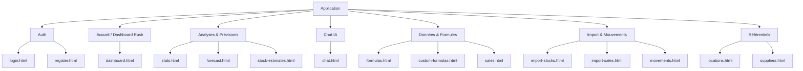
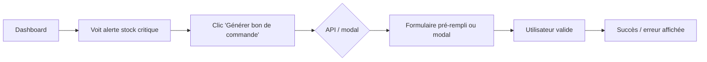
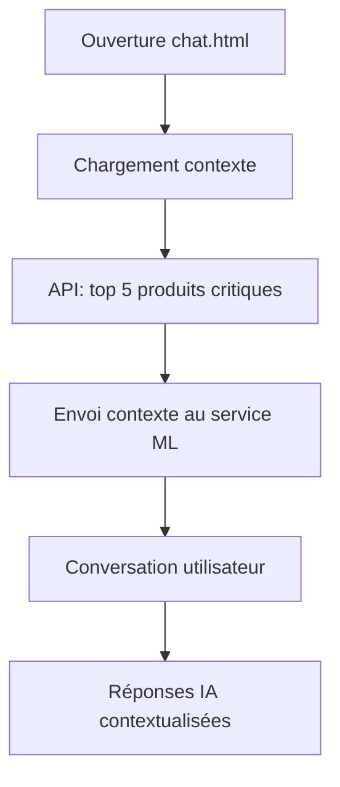
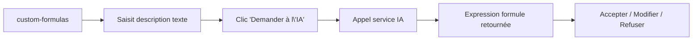
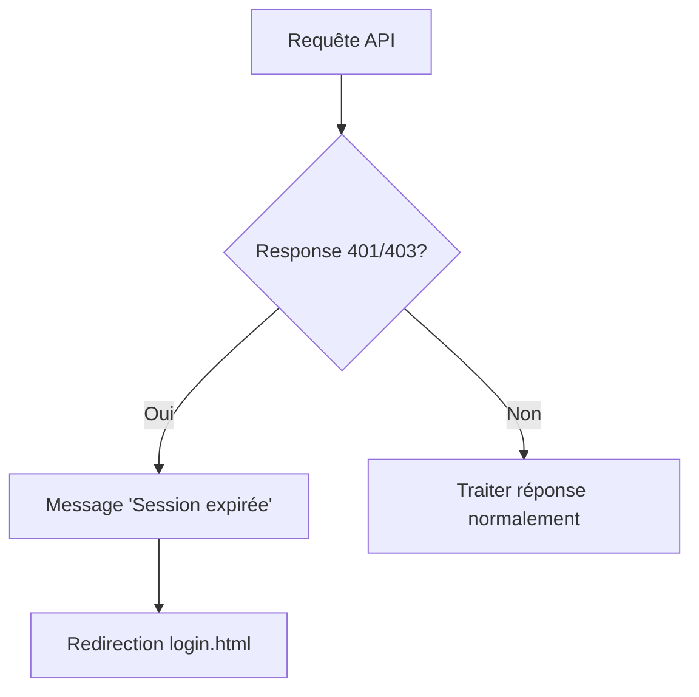
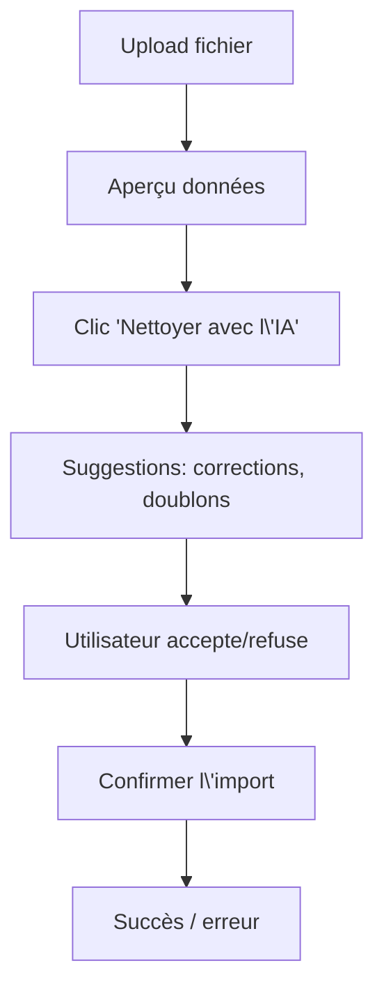

# Flowstock — UI/UX Specification

**Focus : Restauration, Nightlife & Real-time Stock Management**  
**Fichier de sortie :** `docs/front-end-spec.md`

---

## 1. Introduction

Ce document définit les objectifs d’expérience utilisateur, l’architecture de l’information, les parcours utilisateur et les spécifications de design visuel pour l’interface du **Flowstock**, SaaS de gestion de stocks en temps réel pour la restauration et le monde de la nuit (Horeca). Il sert de base pour un design **Mobile-First** et **High-Contrast** (lisible en cuisine et dans l'obscurité des bars), aligné sur le brief et le PRD.

**Périmètre couvert par cette spec (alignement brief/PRD) :**

- **Centralisation de l’architecture** : layout partagé (nav + header), design system CSS (variables globales), amélioration de l’api-client (loading global, intercepteur 401/403 → redirection login).
- **Interface agentique** : dashboard actionnable (ex. « Générer un bon de commande »), chat avec contexte automatique (ex. 5 produits les plus critiques), aide IA à la création de formules (custom-formulas).
- **Analyse de données** : prévisions what-if (forecast), explication de la confiance (stock-estimates), nettoyage de données assisté par l’IA (import-stocks, import-sales).
- **UX et sécurité** : filtres par raison dans movements, skeletons de chargement (stats), documentation intégrée (formulas).
- **Optimisation du code** : debounce sur la recherche (stock-estimates), export enrichi (CSV + graphiques/PDF dans stats).

---

## 2. Overall UX Goals & Principles

### 2.1 Target User Personas

- **Restaurateurs & Chefs de cuisine** : Gère les commandes et les alertes au quotidien ; a besoin d’actions rapides (ex. générer un bon de commande depuis une alerte) et d’explications claires (pourquoi une confiance est « basse »).
- **Gérants de bars & nightclubs** : Lutte contre le coulage, réapprovisionnement "live", gestion volumes (fractions de bouteilles) ; interface **High-Contrast** (environnement sombre/bruyant).
- **Utilisateur occasionnel / Admin** : Utilise prévisions avancées (what-if), formules personnalisées, imports et chat IA ; attend une UI proactive (contexte envoyé au chat, bouton « Demander à l’IA » pour les formules).

### 2.2 Usability Goals

- **Rush-first** : Actions en 1–2 clics depuis les alertes (ex. bon de commande), pas de duplication de logique entre pages.
- **Cohérence & résilience** : Une seule barre de navigation et un header commun (layout partagé), une palette et des composants issus d’un design system CSS.
- **Proactivité** : L’IA reçoit le contexte pertinent (produits critiques, etc.) ; l’utilisateur peut demander une formule en langage naturel.
- **Transparence** : Explication des niveaux de confiance (ex. « Manque d’historique sur 30 jours »), étapes de nettoyage des données avant import.
- **Résilience** : Gestion de session (401/403 → redirection login), indicateur de chargement global pour les appels API.

### 2.3 Design Principles

1. **Rush-first, Mobile-First** — Layout, styles et comportements communs (api-client) sont partagés ; les pages restent légères et maintenables.
2. **Traffic Light clair** — Boutons d’action à côté des alertes et des données (dashboard actionnable, exports enrichis).
3. **Contexte avant demande** — Envoyer automatiquement le contexte utile à l’IA (chat, formules) pour réduire la charge cognitive.
4. **Feedback immédiat** — Skeletons sur les pages lourdes, spinner global pendant les requêtes, messages clairs en cas d’erreur ou de session expirée.
5. **High-Contrast & accessible** — Contraste, focus, libellés ; comportement cohérent entre chat, prévisions et outils d’import.

---

## 3. Information Architecture (IA)

### 3.1 Site Map / Screen Inventory

Toutes les écrans listés ci-dessous sont servis sous `apps/api/public/` et seront unifiés par un **layout partagé** (barre de navigation + header commun) ; les pages d’auth (login, register) restent sans nav applicative.

**Légende :**

- **Auth** : Connexion / inscription (pas de nav métier).
- **Accueil** : Dashboard avec alertes, stats résumées et actions immédiates (bon de commande, etc.).
- **Analyses & Prévisions** : Stats détaillées (skeletons), courbes de prévision (what-if), estimations de stock avec explication de la confiance.
- **Chat IA** : Conversation avec contexte automatique (ex. 5 produits les plus critiques).
- **Données & Formules** : Formules prédéfinies + doc/tutoriels, formules personnalisées (« Demander à l’IA »), saisie ventes.
- **Import & Mouvements** : Import stocks/ventes (avec étape nettoyage IA), historique mouvements (filtres par raison).
- **Référentiels** : Emplacements, fournisseurs.

### 3.2 Navigation Structure

- **Navigation principale (layout partagé)** : Barre horizontale ou sidebar avec liens vers Dashboard, Stats, Prévisions (forecast), Estimations (stock-estimates), Chat, Formules (formulas + custom-formulas), Ventes (sales), Imports (import-stocks, import-sales), Mouvements, Référentiels (locations, suppliers). Le header affiche le titre de la page courante et, si authentifié, un lien « Déconnexion » ou profil (redirection gérée par l’api-client en cas de 401/403).
- **Navigation secondaire** : Selon la section (ex. sous-onglets « Formules prédéfinies » / « Formules personnalisées », ou « Import stocks » / « Import ventes ») pour éviter une nav principale surchargée.
- **Fil d’Ariane (breadcrumb)** : Optionnel pour les écrans profonds (ex. Détail produit, Étape 2 d’import) ; pas obligatoire sur le dashboard ou les listes de premier niveau.

**Décision** : La nav principale est rendue par un composant unique (layout.js ou équivalent) inclus sur toutes les pages sauf login/register, pour garantir une entrée cohérente vers chaque zone (Dashboard, Analyses, Chat, Données, Import, Référentiels).

---

## 4. User Flows

Parcours critiques couvrant les 5 axes de la spec (dashboard actionnable, chat contextuel, formules IA, résilience session, import avec nettoyage).

### 4.1 Action immédiate depuis le Dashboard (bon de commande)

**Objectif utilisateur :** À partir d’une alerte de stock critique affichée sur le dashboard, générer un bon de commande en 1–2 clics sans changer de page ou en étant redirigé vers un écran dédié minimal.

**Points d’entrée :** Dashboard (dashboard.html) — bloc « Alertes » avec liste d’alertes (niveau high/medium/low).

**Critères de succès :** Chaque alerte (ou type d’alerte pertinent) propose un bouton d’action explicite (ex. « Générer un bon de commande ») ; l’utilisateur clique → soit ouverture d’un modal / panneau, soit navigation vers un écran de génération pré-rempli avec le produit/contexte de l’alerte. **Bouton à états (SaaS Pro) :** le bouton passe par un état « en cours » (spinner intégré dans le bouton, même ligne d’alerte) puis « confirmé » (icône check vert) directement dans la ligne de l’alerte, sans quitter la page.

**Schéma de flux :**

**Cas limites et erreurs :** Token expiré pendant l’action → intercepteur 401/403 redirige vers login. API indisponible → message clair + possibilité de réessayer. Alerte déjà traitée → bouton désactivé ou libellé « Déjà commandé » selon règle métier.

**Notes :** Le bouton doit être visible à côté de chaque alerte (ou sur la ligne), pas caché dans un menu.

---

### 4.2 Chat avec contexte automatique

**Objectif utilisateur :** Obtenir des recommandations de l’IA sans avoir à décrire manuellement la situation (ex. « Quoi commander ? ») ; le système envoie automatiquement le contexte pertinent (ex. les 5 produits les plus critiques).

**Points d’entrée :** Page Chat (chat.html). Contexte injecté au chargement ou à l’ouverture de la conversation (appel API pour récupérer les N produits les plus critiques / alertes).

**Critères de succès :** À l’ouverture du chat, le service ML reçoit le contexte (ex. liste des 5 produits critiques) ; l’utilisateur peut poser des questions courtes et recevoir des réponses adaptées à ce contexte. **Indicateur de contexte IA (SaaS Pro) :** une petite pastille lumineuse ou un bandeau discret en haut de la fenêtre de chat indique que « L’IA analyse vos 5 produits critiques » (ou équivalent), pour rassurer l’utilisateur sur la pertinence des réponses.

**Schéma de flux :**

**Cas limites et erreurs :** Échec chargement contexte → chat utilisable sans contexte, avec message « Contexte non disponible ». Session expirée pendant l’envoi → redirection login (intercepteur api-client). Réponse ML lente → indicateur de chargement (ou skeleton) sur la zone de réponse.

**Notes :** Ne pas surcharger le contexte ; 5 produits (ou N configurable) est un bon compromis.

---

### 4.3 Création de formule avec « Demander à l’IA » (custom-formulas)

**Objectif utilisateur :** Créer une formule personnalisée à partir d’une description en langage naturel (ex. « Calcule-moi la marge brute après taxes ») via un bouton « Demander à l’IA » qui génère l’expression de la formule.

**Points d’entrée :** Page Formules personnalisées (custom-formulas.html) — zone de saisie ou éditeur de formule + bouton « Demander à l’IA ».

**Critères de succès :** L’utilisateur saisit une description textuelle (et optionnellement des champs existants du système) ; clique sur « Demander à l’IA » ; l’IA retourne une expression de formule (texte ou structure) ; l’utilisateur peut l’accepter (pré-remplissage du champ formule), modifier ou refuser.

**Schéma de flux :**

**Cas limites et erreurs :** Description trop vague → message « Précisez (ex. champs, unités) ». Erreur API ou IA → message clair + possibilité de réessayer. 401/403 → redirection login.

**Notes :** Prévoir un placeholder ou des exemples de descriptions pour guider l’utilisateur.

---

### 4.4 Session expirée (401/403) → redirection login

**Objectif utilisateur :** Ne pas rester bloqué sur une page avec des requêtes qui échouent en 401/403 ; être redirigé vers la page de connexion avec un message explicite.

**Points d’entrée :** Toute page utilisant api-client.js pour des appels API (dashboard, stats, chat, import, etc.).

**Critères de succès :** Un intercepteur dans api-client détecte les réponses 401/403 ; affiche un message court (ex. « Session expirée ») ; redirige vers login.html (avec returnUrl optionnel pour revenir après connexion). Un indicateur de chargement global (spinner) est affiché pendant les requêtes en cours pour éviter les clics multiples.

**Schéma de flux :**

**Cas limites et erreurs :** 403 CSRF déjà géré (refresh token) ; après retry, si toujours 401/403 → redirection. Éviter boucle de redirection si login.html appelle aussi l’API (exclure certaines URLs de l’intercepteur).

**Notes :** Spinner global à gérer dans le layout ou api-client (afficher pendant fetch, masquer à la réponse).

---

### 4.5 Import avec étape de nettoyage des données (IA)

**Objectif utilisateur :** Lors d’un import (stocks ou ventes), passer par une étape de nettoyage assistée par l’IA : correction de noms mal orthographiés, détection de doublons de SKU, avant validation définitive.

**Points d’entrée :** import-stocks.html, import-sales.html — après upload ou saisie du fichier, avant « Confirmer l’import ».

**Critères de succès :** Après chargement du fichier, l’utilisateur voit un aperçu des données ; une action « Nettoyer avec l’IA » (ou équivalent) lance des suggestions (corrections, doublons) ; l’utilisateur peut accepter/refuser par ligne ou en lot ; puis confirmer l’import. Messages clairs en cas d’erreur ou d’indisponibilité de l’IA.

**Schéma de flux :**

**Cas limites et erreurs :** Fichier invalide → message dès l’upload. IA indisponible → proposer import sans nettoyage. 401/403 pendant le nettoyage → redirection login. Gros fichiers → feedback de progression ou limite de taille documentée.

**Notes :** La phase de nettoyage peut être optionnelle (bouton « Importer sans nettoyage ») pour ne pas bloquer les utilisateurs pressés.

---

## 5. Wireframes & Mockups

**Fichiers de design :** Aucun outil externe (Figma/Sketch) imposé pour le MVP. Les maquettes sont décrites dans cette spec et implémentées via le design system (section 6) et les variables CSS (section 7).

**Écrans clés — structure commune :**

| Écran | Rôle | Éléments principaux |
|-------|------|----------------------|
| **Layout partagé** | Nav + header sur toutes les pages (sauf login/register) | Barre de navigation (liens Dashboard, Stats, Prévisions, Chat, Formules, etc.) ; zone de contenu principal ; header avec titre de page + déconnexion |
| **Dashboard de Rush (Flowstock)** | Premier écran en service | Jauges Traffic Light (Vert/Orange/Rouge) ; mise à jour 5–10 s (WebSockets) ; mobile/tablette, high-contrast |
| **Dashboard** | Vue d’ensemble + actions | Cartes stats (ventes, stock, alertes) ; liste d’alertes avec bouton « Générer un bon de commande » par alerte ; liens rapides |
| **Stats** | Données lourdes, perception de vitesse | **Skeletons avec shimmer** : blocs gris animés (shimmer) qui imitent la forme des graphiques et des tableaux — pas de simple texte « Chargement… » ; puis graphiques ; export CSV / PDF |
| **Chat** | Conversation contextualisée | **Indicateur de contexte IA** : pastille ou bandeau discret « L’IA analyse vos 5 produits critiques » ; fil de messages ; champ de saisie |
| **custom-formulas** | Formules + IA | Champ description texte ; bouton « Demander à l’IA » ; champ formule (éditable après suggestion) |
| **Import (stocks/ventes)** | Upload + nettoyage | Upload fichier ; aperçu tableau ; bouton « Nettoyer avec l’IA » ; suggestions (accepte/refuse) ; « Confirmer l’import » |

**Référence visuelle :** Cohérence assurée par **design-system.css** (variables CSS centralisées) : un changement de couleur (ex. bleu primaire) se répercute instantanément sur Dashboard, Chat et Formules. Même layout (layout.js ou composant partagé) sur toutes les pages concernées.

---

## 6. Component Library / Design System

**Approche :** Design system léger basé sur des **variables CSS globales** et un **layout partagé** (nav + header). Pas de librairie tierce imposée ; les composants listés ci-dessous sont les briques réutilisables à implémenter (en HTML/CSS/JS ou composants web).

**Composants de base :**

| Composant | Rôle | Variantes / états | Usage |
|-----------|------|-------------------|--------|
| **Layout (nav + header)** | Barre de navigation + zone header commune | Desktop : barre horizontale ; mobile : menu repliable (burger) | Inclus sur toutes les pages sauf login.html, register.html |
| **Page container** | Zone de contenu principal sous le header | Max-width, padding cohérent | Enveloppe le contenu de chaque page |
| **Bouton d’action primaire** | Actions principales (ex. « Générer un bon de commande ») | Default, hover, disabled, **loading (spinner intégré)**, **confirmé (check vert)** | À côté des alertes : états « en cours » puis « confirmé » **dans la ligne de l’alerte** (SaaS Pro) |
| **Bouton secondaire** | Actions secondaires (ex. « Annuler », « Importer sans nettoyage ») | Default, hover, disabled | Formulaires, modales |
| **Carte (card)** | Bloc de contenu (stats, alerte, produit) | Border-left color par type ; **transition 200–300 ms au survol** pour rendu interactif (SaaS Pro) | Dashboard, listes, stats |
| **Alerte (alert item)** | Une ligne d’alerte avec action | high / medium / low ; bouton d’action à droite avec états loading → confirmé | Dashboard — bloc alertes |
| **Spinner global** | Indicateur de chargement pendant les appels API | Visible / masqué | Géré par api-client ou layout ; overlay léger possible |
| **Skeleton** | Placeholder de chargement (perception de vitesse) | **Blocs gris animés (shimmer)** qui **imitent la forme** des graphiques et des tableaux (stats.html) — **jamais un simple texte « Chargement… »** | stats.html et autres pages lourdes pendant fetch |
| **Message d’erreur** | Affichage erreur API ou validation | Inline / bandeau | Sous formulaire ou en haut de la zone de contenu |
| **Breadcrumb** | Fil d’Ariane (optionnel) | Liens cliquables | Écrans profonds (détail, étapes d’import) |

**Règles d’usage :** Toutes les couleurs, espacements et typo viennent du fichier **design-system.css** (variables CSS) ; un changement (ex. bleu primaire) se répercute instantanément sur Dashboard, Chat et Formules. Pas de styles inline ni de feuilles par page pour les éléments communs ; tout passe par cette feuille globale + le layout.

---

## 7. Branding & Style Guide

**Identité :** Alignement avec une identité « SaaS pro, lisible, accessible ». Pas de charte externe imposée pour le MVP ; les valeurs ci-dessous assurent la cohérence entre chat, prévisions et outils d’import.

### 7.1 Palette (variables CSS)

Centraliser **toutes** les couleurs dans un seul fichier **design-system.css**. Changer une valeur (ex. le bleu primaire) met à jour l’ensemble de l’app (Dashboard, Chat, Formules, stats, etc.) sans retoucher chaque page.

| Rôle | Variable suggérée | Usage |
|------|-------------------|--------|
| Primaire | `--color-primary` | Liens, boutons primaires, accents |
| Secondaire | `--color-secondary` | Fond de sections, bordures légères |
| Succès | `--color-success` | Confirmations, états OK |
| Avertissement | `--color-warning` | Alertes medium, cautions |
| Erreur | `--color-error` | Alertes high, erreurs, destructif |
| Texte principal | `--color-text` | Corps de texte |
| Texte secondaire | `--color-text-muted` | Labels, métadonnées |
| Fond page | `--color-bg-page` | Arrière-plan général |
| Fond carte | `--color-bg-card` | Cartes, panneaux |
| Bordures | `--color-border` | Séparateurs, contours |

**Exemple de valeurs (alignées avec l’existant dashboard) :** primary `#3b82f6`, success `#10b981`, warning `#f59e0b`, error `#ef4444`, text `#1e293b`, muted `#64748b`, bg-page `#f5f5f5`, bg-card `#ffffff`, border `#e2e8f0`. **Accessibilité :** pour les badges d’alerte (high/medium/low), garantir un **contraste ≥ 4,5:1** entre le texte et le fond coloré (vérifier chaque combinaison dans design-system.css).

### 7.2 Typographie

- **Police principale :** `system-ui, -apple-system, sans-serif` (ou police métier si définie plus tard).
- **Échelle :** Titres H1/H2/H3, corps, small — tailles et line-height définis via variables (ex. `--font-size-body`, `--line-height-body`) pour cohérence.

### 7.3 Icônes et espacements

- **Icônes :** Bibliothèque légère (SVG inline ou icon font) ; même style sur toute l’app (taille, couleur via variables).
- **Grille / espacements :** Échelle d’espacement cohérente (ex. 0.25rem, 0.5rem, 1rem, 1.5rem) via variables `--space-*` ; grille flexible pour cartes et listes (grid/flex).

---

## 8. Accessibility Requirements

**Cible :** Niveau AA (WCAG 2.1) pour les écrans métier (dashboard, stats, chat, formules, import). Login/register inclus.

**Exigences principales :**

- **Contraste :** Ratio **≥ 4,5:1** pour le texte normal, ≥ 3:1 pour le texte large ; utiliser les variables du design-system.css. **Contrastes élevés obligatoires** sur les textes sur fond coloré, **en particulier pour les badges d’alerte** (high/medium/low) : chaque badge doit respecter 4,5:1 pour le libellé sur son fond.
- **Focus :** Indicateur de focus visible sur tous les éléments interactifs (liens, boutons, champs, onglets nav) ; pas de `outline: none` sans remplacement (ex. `box-shadow` ou bordure).
- **Navigation clavier :** Parcours logique (ordre de tab) ; accès au menu de navigation et aux actions (ex. « Générer un bon de commande ») sans souris.
- **Formulaires :** Labels associés aux champs (id/for ou aria-label) ; messages d’erreur reliés aux champs (aria-describedby ou aria-invalid) ; import et custom-formulas en particulier.
- **Contenu dynamique :** Annonces pour le chargement (skeletons, spinner) et les erreurs (aria-live ou rôle status) pour les utilisateurs de lecteurs d’écran.
- **Cibles tactiles :** Zone cliquable ≥ 44×44 px pour les boutons d’action et les liens de la nav (mobile).

**Tests :** Vérification manuelle clavier + lecteur d’écran (NVDA/VoiceOver) sur les parcours critiques (dashboard, chat, import, login) ; outil automatique (Lighthouse ou axe) en complément.

---

## 9. Responsiveness Strategy

**Breakpoints recommandés :** Mobile (< 768px), tablette (768px–1024px), desktop (> 1024px). **Flowstock :** priorité **Mobile-First** (tablette et smartphone pour cuisine/bar) ; desktop en complément. Valeurs à centraliser en variables CSS (ex. `--breakpoint-md`, `--breakpoint-lg`) si besoin.

**Adaptations :**

- **Layout :** Navigation principale en barre horizontale sur desktop ; sur mobile, menu repliable (burger) pour garder l’espace contenu. Zone de contenu en une colonne sur mobile, grille multi-colonnes sur desktop (dashboard, stats, listes).
- **Tableaux (stats, import, mouvements) :** Scroll horizontal ou cartes empilées sur petit écran ; conserver lisibilité des en-têtes et des actions (boutons visibles ou dans menu d’action).
- **Chat :** Zone messages + saisie en pleine largeur sur mobile ; même ordre (contexte en haut, puis messages, puis champ).
- **Formulaires (custom-formulas, import) :** Champs en bloc pleine largeur sur mobile ; regroupement logique et CTA toujours accessibles sans scroll excessif.

**Priorité contenu :** Sur les écrans étroits, afficher en premier les infos critiques (alertes, bouton d’action, état d’import) puis les détails secondaires.

---

## 10. Animation & Micro-interactions

**Principes :** Animations légères et courtes pour le feedback utilisateur ; pas d’animation bloquante pour le contenu essentiel. Performance privilégiée (transform/opacity, éviter layout thrashing).

**Interactions clés :**

- **Skeletons :** Blocs gris animés avec **effet shimmer** qui imitent la forme des graphiques et des tableaux (stats.html) ; pas de simple texte « Chargement… ». Disparition en douceur au chargement des données réelles.
- **Cartes dashboard :** **Transition douce 200–300 ms au survol** (ex. légère élévation ou changement de bordure) pour un rendu SaaS pro et interactif.
- **Boutons :** État hover/focus (couleur ou léger scale) ; état **loading** (spinner intégré dans le bouton) puis état **confirmé** (check vert) pour « Générer un bon de commande » directement dans la ligne d’alerte ; idem pour « Demander à l’IA », « Nettoyer avec l’IA ».
- **Messages :** Apparition discrète des messages d’erreur ou de succès (ex. fade-in court) pour attirer l’attention sans être intrusif.
- **Navigation / modales :** Ouverture/fermeture de menu mobile ou modale avec transition courte (ex. 200–300 ms) pour éviter un effet « flash ».

**Accessibilité :** Respect de `prefers-reduced-motion` : désactiver ou réduire les animations (pas de shimmer, transitions minimales) lorsque l’utilisateur a activé cette préférence.

---

## 11. Performance Considerations

**Objectifs :**

- **Premier affichage :** Layout et nav visibles rapidement ; contenu dynamique (stats, alertes) chargé ensuite avec skeletons puis données.
- **Requêtes API :** Spinner global pendant les appels ; éviter les requêtes en double (ex. debounce sur recherche stock-estimates comme demandé).
- **Pages lourdes (stats, import) :** Utiliser skeletons pour `/sales/summary` et lors du traitement d’import ; si besoin, pagination ou chargement progressif pour gros tableaux.

**Stratégies design :**

- Réduction de la duplication (layout + feuille globale) pour limiter le volume de CSS et le temps de rendu.
- Priorité au contenu above-the-fold (alertes, CTA) ; chargement différé possible pour graphiques ou sections secondaires si nécessaire plus tard.

---

## 12. Next Steps

**Actions recommandées après validation de cette spec :**

1. **Implémenter le layout partagé** — Créer `layout.js` (ou composant équivalent) avec barre de navigation et header ; l’inclure sur toutes les pages sauf login/register ; retirer la duplication de nav/header dans chaque HTML.
2. **Introduire design-system.css** — Fichier unique avec toutes les variables (couleurs, typo, espacements) ; un changement (ex. bleu primaire) met à jour Dashboard, Chat, Formules instantanément. Remplacer les styles inline et les `<style>` par page par des classes utilisant ces variables.
3. **Améliorer api-client.js** — Ajouter le spinner global (affichage pendant fetch) et l’intercepteur 401/403 avec redirection vers `login.html` et message « Session expirée ».
4. **Rendre le dashboard actionnable** — Bouton « Générer un bon de commande » à côté de chaque alerte, avec états **en cours** (spinner dans le bouton) puis **confirmé** (check vert) dans la ligne d’alerte ; brancher sur l’API ou le flux produit.
5. **Chat contextuel + indicateur IA** — Envoyer le contexte (ex. 5 produits critiques) au ML à l’ouverture ; afficher une **pastille ou bandeau discret** « L’IA analyse vos 5 produits critiques » en haut de la fenêtre de chat.
6. **Formules : « Demander à l’IA »** — Sur custom-formulas.html, ajouter le bouton et le flux description → appel IA → pré-remplissage de l’expression avec option accepter/modifier/refuser.
7. **Prévisions what-if, confiance, import** — Enrichir forecast.html (simulation what-if), stock-estimates.html (explication confiance + debounce recherche), import-stocks/import-sales (étape nettoyage IA) selon les user flows décrits.
8. **UX : skeletons (shimmer), filtres, doc** — Sur stats.html : **blocs gris animés (shimmer)** qui imitent la forme des graphiques et des tableaux (pas de simple « Chargement… ») ; filtres par raison sur movements.html ; documentation/tutoriels sur formulas.html.
9. **Export enrichi** — Sur stats.html, étendre l’export (CSV + option graphiques en images ou rapport PDF côté client si pertinent).
10. **Vérification accessibilité et responsive** — Tester clavier, lecteur d’écran et breakpoints sur les parcours critiques ; valider contraste et focus.

**Handoff :** Cette spec peut servir de base pour des maquettes détaillées (Figma) ou pour un passage direct au front-end (HTML/CSS/JS) en s’appuyant sur le design system et les user flows. Toute évolution (nouvelles pages, nouveaux composants) doit réutiliser le layout et les variables CSS pour garder la cohérence.

---

## 13. Change Log

| Date | Version | Description | Auteur |
|------|---------|-------------|--------|
| (à remplir) | 1.0 | Création spec UI/UX — centralisation architecture, UI agentique, analyse données, UX/sécurité, optimisations | UX Expert |
| (à remplir) | 1.1 | Affinage SaaS Pro : skeletons shimmer, variables design-system.css, indicateur contexte Chat, boutons à états (loading → confirmé), contrastes badges, micro-animations cartes 200–300 ms | UX Expert |
| 2026-02-22 | 1.2 | Alignement brief/PRD Flowstock : titre Flowstock, intro + périmètre (Dashboard Rush Traffic Light, Connecteur POS, Scan-to-Recipe, onboarding <15 min, déclaration perte), personas (Restaurateurs, Bars/Nightclubs), Usability (Rush-first, zéro saisie, High-Contrast), Design Principles (Rush-first, Traffic Light, High-Contrast), IA (Dashboard Rush), Wireframes (Dashboard de Rush), Change Log | UX Expert |
