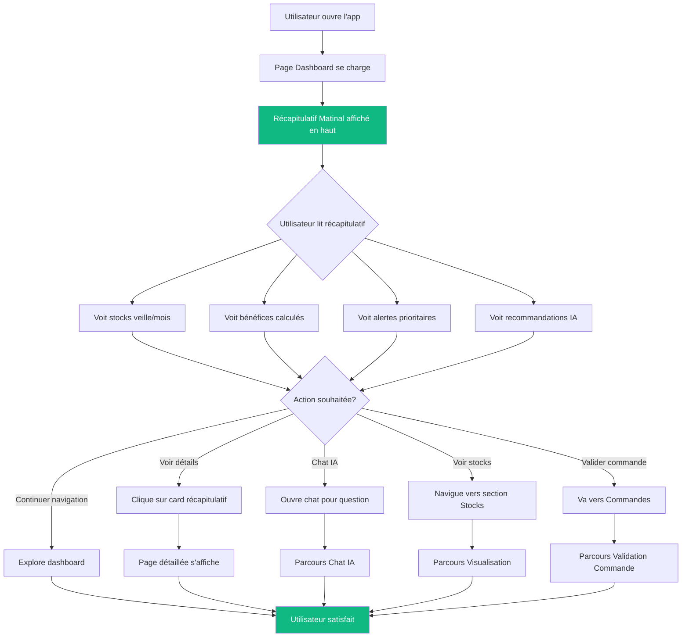
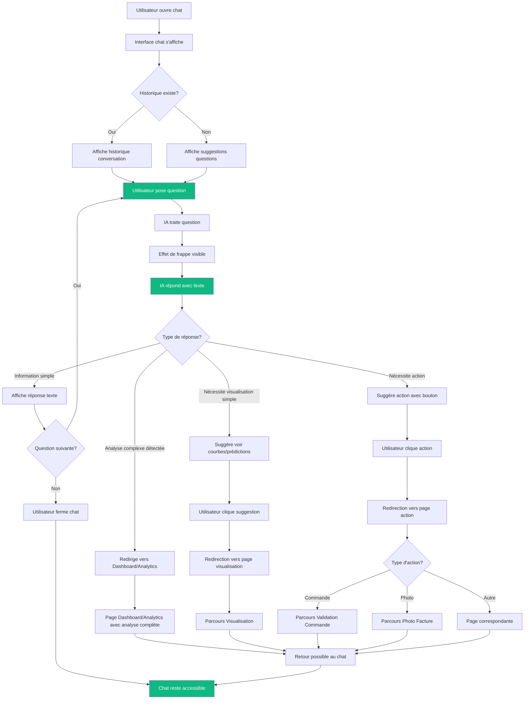
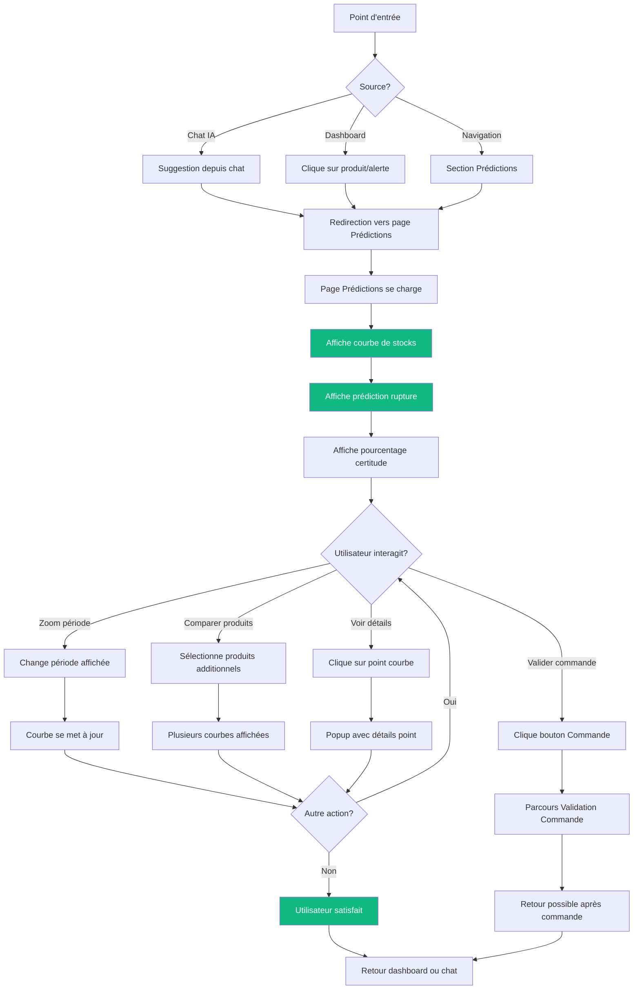
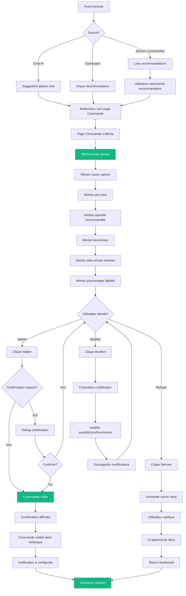

```mermaid
flowchart TD
    A[Point d'entrée] --> B{Source?}
    B -->|Chat IA| C[Suggestion depuis chat]
    B -->|Section Factures| D[Clique Upload Facture]
    B -->|Après commande| E[Lien depuis commande]
    C --> F[Redirection vers upload]
    D --> F
    E --> F
    F --> G[Interface upload s'affiche]
    G --> H[Utilisateur prend/upload photo]
    H --> I{Photo valide?}
    I -->|Non| J[Message erreur format]
    J --> K[Demande nouvelle photo]
    K --> H
    I -->|Oui| L[Photo uploadée]
    L --> M[Extraction IA démarre]
    M --> N[Indicateur chargement visible]
    N --> O[IA extrait données]
    O --> P{Extraction réussie?}
    P -->|Non| Q[Confiance < seuil]
    P -->|Oui| R[Récapitulatif affiché]
    Q --> S[Option saisie manuelle]
    S --> T[Formulaire saisie manuelle]
    T --> U[Utilisateur saisit données]
    U --> V[Validation données]
    V --> W{Données valides?}
    W -->|Non| X[Message erreur]
    X --> T
    W -->|Oui| R
    R --> Y[Affiche produits extraits]
    Y --> Z[Affiche quantités]
    Z --> AA[Affiche prix]
    AA --> AB[Affiche total]
    AB --> AC{Utilisateur vérifie?}
    AC -->|Modifier| AD[Clique sur élément]
    AD --> AE[Formulaire modification]
    AE --> AF[Sauvegarde modification]
    AF --> AC
    AC -->|Valider| AG{Commande associée?}
    AG -->|Oui| AH[Vérification auto vs commande]
    AG -->|Non| AI[Pas de vérification]
    AH --> AJ{Différences détectées?}
    AJ -->|Oui| AK[Alerte différences]
    AJ -->|Non| AL[Vérification OK]
    AK --> AM[Utilisateur voit différences]
    AM --> AN{Approuve différences?}
    AN -->|Oui| AO[Confirme avec notes]
    AN -->|Non| AD
    AL --> AP[Demande autorisation intégration]
    AI --> AP
    AO --> AP
    AP --> AQ{Utilisateur autorise?}
    AQ -->|Oui| AR[Intégration BDD]
    AQ -->|Non| AS[Annule intégration]
    AR --> AT[Mise à jour stocks]
    AT --> AU[Mouvements créés]
    AU --> AV[Historique mis à jour]
    AV --> AW[Confirmation succès]
    AW --> AX[Lien vers stocks mis à jour]
    AS --> AY[Retour liste factures]
    AX --> AZ[Utilisateur satisfait]
    AY --> AZ
    
    style R fill:#10b981,color:#fff
    style AR fill:#10b981,color:#fff
    style AZ fill:#10b981,color:#fff
```

# UX Design Specification bmad-stock-agent

**Author:** Yanis-M
**Date:** 2026-01-28T10:44:52.327Z

---

## Executive Summary

### Project Vision

FlowStock est un SaaS de gestion de stocks avec intelligence artificielle prédictive, conçu spécifiquement pour les PME et e-commerces. Le produit vise à remplacer les solutions manuelles (Excel) et les outils trop coûteux pour les grandes entreprises, en offrant des prévisions précises de rupture de stocks, une interface visuelle simple, et des fonctionnalités d'automatisation à un prix accessible (100-200€/mois).

L'IA est le cœur différenciant du produit - sans elle, le produit perd son avantage concurrentiel. Le MVP se concentre sur trois priorités critiques : (1) Moteur IA de prédictions, (2) Interface visuelle simple, (3) Système de commandes + photo facture IA.

### Target Users

**Segment Primaire : Gérants de PME (Cafés, Petits Stores)**
- Propriétaires ou gérants de petites entreprises (5-50 employés)
- Secteurs : cafés, restaurants, petits commerces de détail, boutiques physiques
- Niveau technique : Non-techniques, recherchent simplicité maximale
- Budgets limités (ne peuvent pas se payer solutions grandes entreprises)
- Usage principal : Desktop/Tablette pour décisions et gestion complète

**Segment Secondaire : Propriétaires E-commerce**
- Propriétaires de boutiques en ligne (Shopify, Amazon, etc.)
- Vente multi-plateformes (en ligne + parfois physique)
- Besoin de synchronisation multi-plateformes

**Segment Tertiaire : Employés (Mobile)**
- Tous les employés de l'entreprise
- Besoin d'accès rapide aux informations essentielles
- Usage mobile pour consultation rapide et actions simples
- Notifications push pour alertes importantes (commandes, ruptures)

### Key Design Challenges

1. **Simplicité vs Puissance** - Équilibrer fonctionnalités avancées (IA, calculs personnalisés) avec simplicité pour utilisateurs non-techniques

2. **Confiance en l'IA** - Rendre les prédictions transparentes et compréhensibles pour gagner la confiance des utilisateurs PME

3. **Migration depuis Excel** - Faciliter la transition depuis Excel et montrer la valeur immédiate dès le premier jour

4. **Cohérence Multi-plateforme** - Maintenir une expérience cohérente entre dashboard desktop détaillé et interface mobile simplifiée

5. **Hiérarchie d'Information Adaptative** - Adapter le contenu selon le contexte d'usage (décision sur desktop vs consultation rapide sur mobile)

6. **Notifications Intelligentes** - Équilibrer information et action dans les notifications push sans surcharger les utilisateurs

### Design Opportunities

1. **Visualisation des Données** - Remplacer les lignes Excel par des visualisations claires (couleurs distinctes, graphiques intuitifs, alertes visuelles)

2. **Progressive Disclosure Mobile** - Masquer la complexité sur mobile, exposer seulement l'essentiel pour une utilisation rapide

3. **Actions Rapides Mobile** - Permettre des actions critiques depuis mobile (validation commande, consultation stocks, réception notifications)

4. **Feedback IA Transparent** - Expliquer les prédictions et recommandations de manière compréhensible pour renforcer la confiance

5. **Onboarding Progressif** - Guider les utilisateurs vers les fonctionnalités avancées au fil du temps, différencié selon rôle et plateforme

6. **Synchronisation Temps Réel** - Garantir la cohérence des données entre desktop et mobile pour une expérience fluide multi-utilisateurs

## Core User Experience

### Defining Experience

L'expérience centrale de FlowStock est centrée sur un **chat conversationnel avec l'agent IA** comme point d'entrée principal et interface universelle pour accéder rapidement aux informations sur les stocks. Cette approche évite aux utilisateurs de passer du temps à rechercher des informations dans des interfaces complexes.

**Chat IA comme interface principale :**
- Disponible sur toutes les plateformes (desktop, tablette, mobile)
- Interface principale sur mobile pour accès rapide et simple
- Compréhensible et simple sur mobile pour une utilisation rapide
- Peut communiquer avec le reste de l'application et générer des commandes comme si l'IA avait détecté elle-même une rupture
- Historique de conversation avec mémoire contextuelle (ex: "combien d'ordi de telle marque" puis "leurs prix" - le chat se souvient du contexte)

L'expérience se construit autour de trois actions critiques qui doivent s'enchaîner de manière fluide :

1. **Chat IA pour accès rapide** - Interface conversationnelle permettant d'obtenir instantanément les informations sur les stocks sans navigation complexe, avec mémoire contextuelle

2. **Visualisation claire des courbes et prédictions** - Affichage intuitif et interactif des courbes de stocks et des prédictions IA avec pourcentage de certitude affiché à chaque fois, permettant comparaison de produits via bouton dédié

3. **Réapprovisionnement automatique transparent** - Système de recommandations de commande proposé par l'agent IA avec explications détaillées (cause/explication de rupture, prix, quantité, fournisseur, date estimée arrivée, pourcentage fiabilité), mode aperçu, possibilité de modifier/refuser, code couleur clair pour urgences

4. **Système de photo fluide avec contrôle** - Workflow de photo de facture qui n'est pas "magique" mais fluide et compréhensible : récapitulatif après chaque photo, possibilité de modifier si erreur détectée, ne s'ajoute pas automatiquement (demande autorisation), plusieurs photos possibles mais pas de répétition d'articles

**Principe fondamental** : Toutes ces actions doivent s'enchaîner sans casser l'expérience ou prendre trop de temps. La fluidité et la continuité sont essentielles, mais l'utilisateur garde toujours le contrôle final.

### Platform Strategy

**Multi-plateforme avec expériences différenciées :**

- **Desktop/Tablette** : Dashboard détaillé avec toutes les fonctionnalités complètes, chat IA intégré, visualisations avancées interactives, section paramètres complète pour autonomie de l'agent
- **Mobile** : Chat IA comme interface principale, simple et rapide, notifications push pour alertes critiques (commandes, ruptures), actions rapides essentielles, visualisations simplifiées mais fonctionnelles
- **Synchronisation temps réel** : Cohérence des données entre toutes les plateformes pour une expérience fluide multi-utilisateurs

**Approche Progressive Disclosure** : Complexité masquée sur mobile, fonctionnalités complètes sur desktop, mais chat IA accessible partout pour accès rapide.

### Effortless Interactions

1. **Chat IA comme accès universel** - Poser une question naturelle et obtenir la réponse instantanément, sans navigation, avec mémoire contextuelle pour conversations fluides

2. **Actions depuis le chat** - Possibilité d'exécuter des actions directement depuis la conversation (commander, voir courbes, prendre photo, générer commande comme si rupture détectée)

3. **Visualisation contextuelle interactive** - Les courbes et prédictions apparaissent automatiquement quand pertinentes dans le contexte de la conversation, avec pourcentage de certitude toujours visible, possibilité de comparaison via bouton

4. **Réapprovisionnement en un clic avec transparence totale** - Validation des recommandations de l'agent IA avec toutes les informations nécessaires visibles (cause, prix, quantité, fournisseur, date, fiabilité), mode aperçu avant validation, possibilité modifier/refuser, code couleur pour urgences

5. **Workflow photo avec contrôle utilisateur** - Photo → extraction → récapitulatif → vérification/modification → demande autorisation → intégration dans un flux continu mais contrôlé

6. **Transitions fluides** - Passage naturel entre chat, visualisations, et actions sans rechargement ou attente perceptible

7. **Gestion visuelle des stocks** - Classement par couleurs, par taille, visualisation de l'espace pris dans l'entrepôt et pourcentage d'utilisation entrepôt/magasin

8. **Correction et apprentissage IA** - Possibilité de corriger l'IA, section remarques en langage naturel pour expliquer ce qui va/ne va pas, permettant amélioration continue

### Critical Success Moments

1. **Premier chat réussi avec mémoire contextuelle** - L'utilisateur pose une question, puis une question de suivi, et le chat se souvient du contexte (ex: "combien d'ordi de telle marque" puis "leurs prix"), réalisant que c'est plus rapide et intelligent que de chercher manuellement

2. **Visualisation interactive des prédictions** - L'utilisateur voit clairement la courbe de stocks avec pourcentage de certitude, comprend intuitivement quand il doit commander, peut comparer plusieurs produits, avec confiance dans les prédictions IA

3. **Première commande validée avec transparence** - L'utilisateur voit toutes les informations (cause rupture, prix, quantité, fournisseur, date, fiabilité), comprend pourquoi c'était nécessaire, peut modifier ou refuser, avec sentiment de contrôle et de confiance

4. **Photo de facture intégrée avec contrôle** - L'utilisateur prend une photo, voit le récapitulatif, peut modifier si erreur, donne autorisation, et les stocks sont mis à jour automatiquement sans saisie manuelle mais avec contrôle total

5. **Réalisation "c'est mieux qu'Excel"** - Moment où l'utilisateur comprend qu'il gagne du temps pour gérer, que tout est beaucoup plus visuel, clair et agréable à la vue que les lignes Excel

6. **Confiance en l'IA établie** - L'utilisateur fait confiance à l'IA quand elle lui permet de résoudre un problème et qu'il se rend compte que c'est vraiment juste, avec possibilité de corriger et d'expliquer en langage naturel ce qui va/ne va pas

**Moments d'échec à éviter** :
- Chat IA qui ne comprend pas le contexte ou donne des réponses incorrectes
- Visualisations confuses ou prédictions sans pourcentage de certitude visible
- Recommandations de commande sans explication claire (risque de perte de confiance)
- Système de photo qui ajoute automatiquement sans autorisation ou qui échoue silencieusement
- Manque de contrôle utilisateur sur les actions critiques

### Experience Principles

1. **Conversation First avec Mémoire Contextuelle** - Le chat IA est le point d'entrée principal sur toutes les plateformes, permettant d'accéder à toutes les fonctionnalités sans navigation complexe, avec mémoire du contexte de conversation. **Garde-fou** : Le chat reste un outil d'exécution rapide - les analyses complexes sont redirigées vers Dashboard/Analytics pour éviter le "Chat Fourre-tout"

2. **Transparence Totale** - Toutes les recommandations IA doivent être expliquées clairement (cause rupture, prix, quantité, fournisseur, date, fiabilité) pour éviter les risques et gagner la confiance, avec pourcentage de certitude toujours visible

3. **Fluidité Absolue avec Contrôle Utilisateur** - Les actions doivent s'enchaîner naturellement sans rupture d'expérience ou temps d'attente perceptible, mais l'utilisateur garde toujours le contrôle final (modifier, refuser, autoriser)

4. **Clarté Visuelle Interactive** - Les visualisations (courbes, prédictions) doivent être immédiatement compréhensibles, interactives, avec pourcentage de certitude affiché, possibilité de comparaison, codes couleur pour urgences

5. **Contrôle Utilisateur Total** - L'utilisateur garde toujours le contrôle final sur les actions critiques (commandes, intégrations), même si proposées par l'IA, avec mode aperçu, possibilité modifier/refuser, autorisation requise

6. **Pas de Magie Noire, Mais Fluidité** - Les fonctionnalités automatisées (photo, extraction) doivent être compréhensibles et vérifiables (récapitulatif, modification possible), pas "magiques" mais fluides, avec autorisation avant intégration

7. **Apprentissage et Amélioration Continue** - Possibilité de corriger l'IA et d'expliquer en langage naturel ce qui va/ne va pas, permettant amélioration continue de l'agent

8. **Gestion Visuelle et Spatiale** - Classement par couleurs, par taille, visualisation de l'espace et pourcentage d'utilisation entrepôt/magasin pour une compréhension immédiate

9. **Paramètres et Autonomie Configurable** - Section paramètres permettant de choisir le niveau d'autonomie de l'agent IA et autres paramètres selon les préférences utilisateur

10. **Chat Simple, Analyses dans Dashboard** - Le chat IA reste un outil d'exécution rapide et de consultation simple. Les analyses complexes (gros tableaux, graphiques détaillés, historiques longs) sont redirigées vers Dashboard/Analytics pour éviter le "Chat Fourre-tout" et maintenir la fluidité de la conversation

11. **Densité Modulaire selon Plateforme** - Desktop : densité efficace pour productivité maximale. Mobile : interface aérée et tactile optimisée pour usage à une main en entrepôt (boutons plus grands, listes moins denses, espacement généreux)

## Desired Emotional Response

### Primary Emotional Goals

**Bonheur Quotidien Sans Prise de Tête**
L'utilisateur doit être heureux de voir son stock chaque jour sans avoir à lire des lignes et des lignes pendant plusieurs heures. L'expérience doit être agréable, visuelle et immédiate, remplaçant la frustration d'Excel par un sentiment de facilité et de plaisir.

**Satisfaction de la Prévention**
L'utilisateur doit ressentir une satisfaction profonde quand une rupture ou un surstockage est évité grâce aux prédictions IA et aux alertes proactives. Ce sentiment de réussite et de contrôle renforce la confiance dans l'outil.

**Confiance Absolue dans les Données**
L'utilisateur ne doit plus se poser de questions sur la fiabilité des données. La transparence totale (pourcentages de certitude, explications, possibilité de vérification) doit créer un sentiment de confiance inébranlable.

**Fluidité et Simplicité**
L'expérience doit être fluide, sans interruption, simple d'utilisation et claire. L'utilisateur doit se sentir dans un flux naturel, sans friction, où tout fonctionne comme prévu.

### Emotional Journey Mapping

**Découverte Initiale**
- Curiosité et espoir : "Est-ce que ça peut vraiment remplacer Excel ?"
- Soulagement anticipé : "Enfin une solution simple et abordable"

**Première Utilisation**
- Surprise agréable : "C'est si simple et visuel !"
- Confiance naissante : "Les données semblent fiables"

**Utilisation Quotidienne**
- Bonheur récurrent : "Je vois mon stock en quelques secondes, sans prise de tête"
- Satisfaction continue : "Je n'ai plus à lire des lignes pendant des heures"
- Confiance croissante : "Les prédictions sont justes, je peux faire confiance"

**Moments de Succès**
- Satisfaction profonde : "J'ai évité une rupture grâce à l'alerte"
- Accomplissement : "Le surstockage est évité, mon cash n'est plus bloqué"
- Fierté : "Je gère mieux mes stocks qu'avant"

**En Cas de Problème**
- Confiance maintenue : "Je peux corriger et expliquer, l'IA apprend"
- Contrôle préservé : "Je garde toujours le contrôle final"

**Retour Régulier**
- Anticipation positive : "Je vais voir mon stock rapidement"
- Sérénité : "Je sais que tout est sous contrôle"

### Micro-Emotions

**Confiance vs Confusion**
- Favoriser : Transparence totale, explications claires, pourcentages de certitude visibles
- Éviter : Données sans contexte, prédictions mystérieuses, informations contradictoires

**Satisfaction vs Frustration**
- Favoriser : Actions fluides, pas d'attente, corrections faciles, visualisations claires
- Éviter : Interruptions, temps d'attente, étapes complexes, interface confuse

**Sérénité vs Anxiété**
- Favoriser : Alertes proactives, prédictions fiables, contrôle visible, prévention des problèmes
- Éviter : Surprises négatives, ruptures non anticipées, données incertaines

**Plaisir vs Ennui**
- Favoriser : Interface visuelle agréable, interactions naturelles, chat conversationnel, visualisations engageantes
- Éviter : Lignes de texte monotones, navigation complexe, interface terne

**Confiance vs Scepticisme**
- Favoriser : Transparence IA, explications détaillées, possibilité de vérification, historique de précision
- Éviter : Boîte noire IA, recommandations sans justification, données non vérifiables

### Design Implications

**Pour Créer le Bonheur Quotidien**
- Visualisations immédiates et claires (courbes, graphiques, codes couleur)
- Chat IA pour accès rapide sans navigation
- Dashboard avec vue d'ensemble en un coup d'œil
- Pas de lecture de lignes - tout visuel et intuitif

**Pour Générer la Satisfaction de Prévention**
- Alertes visuelles claires et proactives
- Notifications push pour ruptures imminentes
- Feedback positif quand problème évité ("Rupture évitée grâce à votre commande du 15/01")
- Visualisation de l'impact des actions (avant/après)

**Pour Établir la Confiance Absolue**
- Pourcentage de certitude toujours visible sur toutes les prédictions
- Explications détaillées pour chaque recommandation (cause, raisonnement)
- Possibilité de vérification et correction
- Historique de précision des prédictions IA
- Transparence totale sur les sources de données

**Pour Assurer Fluidité et Simplicité**
- Interactions sans interruption perceptible
- Transitions fluides entre les actions
- Interface claire et intuitive
- Pas de friction dans les workflows
- Actions en un clic quand approprié
- Messages d'erreur clairs et actionnables

### Emotional Design Principles

1. **Plaisir Visuel Quotidien** - Chaque interaction doit être agréable visuellement, remplaçant la frustration d'Excel par un plaisir de consultation quotidien

2. **Satisfaction de la Prévention** - Mettre en avant les succès (ruptures évitées, surstockages prévenus) pour créer un sentiment d'accomplissement continu

3. **Confiance par Transparence** - Toujours afficher la fiabilité, expliquer les raisons, permettre la vérification pour créer une confiance inébranlable

4. **Fluidité Absolue** - Aucune interruption, aucune friction, tout doit couler naturellement pour créer un sentiment de facilité

5. **Simplicité Révélée** - L'interface doit être si simple et claire que l'utilisateur ne se pose jamais la question "comment faire ?"

6. **Contrôle et Sérénité** - L'utilisateur doit toujours sentir qu'il a le contrôle et que tout est sous contrôle, créant une sérénité dans la gestion quotidienne

7. **Feedback Positif Continu** - Renforcer les bonnes actions et les succès pour créer un sentiment de progression et d'accomplissement

## UX Pattern Analysis & Inspiration

### Inspiring Products Analysis

**Limova.ai - Simplicité et Clarté**
Limova.ai sert de référence principale pour la simplicité d'utilisation et la clarté de l'interface. Ce SaaS démontre comment créer une expérience utilisateur qui s'intègre naturellement à l'environnement de travail de base de l'utilisateur.

**Points forts identifiés :**
- Simplicité d'utilisation remarquable pour utilisateurs non-techniques
- Clarté visuelle immédiate
- Intégration harmonieuse à l'environnement de travail existant
- Interface qui ne nécessite pas de formation extensive

**Leçons à retenir :**
- L'importance de l'intégration naturelle dans le workflow quotidien
- La valeur d'une interface qui "fait sens" immédiatement
- La nécessité de réduire la courbe d'apprentissage au minimum

### Transferable UX Patterns

**Pattern 1 : Page d'Accueil avec Informations Critiques Visibles**
- **Application** : Afficher les informations les plus importantes sur la page d'accueil pour tout de suite comprendre les problèmes
- **Bénéfice** : L'utilisateur voit immédiatement l'état de ses stocks, les alertes critiques, et les actions prioritaires sans navigation
- **Adaptation FlowStock** : Dashboard principal avec vue d'ensemble des stocks, alertes visuelles, recommandations de commande prioritaires, tout visible dès la connexion

**Pattern 2 : Simplicité et Clarté Limova.ai**
- **Application** : Interface simple qui s'intègre naturellement à l'environnement de travail
- **Bénéfice** : Réduction de la friction cognitive, adoption rapide
- **Adaptation FlowStock** : Chat IA comme point d'entrée naturel, visualisations claires sans surcharge, workflow fluide qui remplace Excel sans rupture

**Pattern 3 : Intégration Environnement de Travail**
- **Application** : S'intègre bien à l'environnement de travail de base de l'utilisateur
- **Bénéfice** : Pas de changement radical de workflow, adoption facilitée
- **Adaptation FlowStock** : Workflow qui s'intègre dans les habitudes existantes (consultation matinale, commandes régulières, réception factures), pas de révolution mais amélioration

**Pattern 4 : Visualisations Immédiates**
- **Application** : Comprendre les problèmes immédiatement sans exploration
- **Bénéfice** : Gain de temps, réduction de l'anxiété
- **Adaptation FlowStock** : Courbes de stocks et prédictions visibles immédiatement, codes couleur pour urgences, pourcentages de certitude toujours affichés

### Anti-Patterns to Avoid

**Anti-Pattern 1 : Surcharge d'Information**
- **Problème** : Trop d'informations affichées simultanément crée confusion et anxiété
- **À éviter** : Dashboard surchargé avec toutes les données en même temps
- **Solution FlowStock** : Hiérarchie claire, informations critiques en premier, détails sur demande

**Anti-Pattern 2 : Navigation Complexe**
- **Problème** : Multiples niveaux de navigation frustrent les utilisateurs non-techniques
- **À éviter** : Menu complexe avec sous-menus multiples
- **Solution FlowStock** : Chat IA comme navigation principale, accès direct aux fonctionnalités depuis la conversation

**Anti-Pattern 3 : Interface Agressive**
- **Problème** : Couleurs trop vives ou contrastes agressifs créent fatigue visuelle
- **À éviter** : Palette de couleurs criardes ou trop contrastées
- **Solution FlowStock** : Palette apaisante (navy blue, green electric, blanc) pour usage quotidien confortable

**Anti-Pattern 4 : Erreurs Sans Contexte**
- **Problème** : Messages d'erreur cryptiques frustrent et créent anxiété
- **À éviter** : Erreurs techniques sans explication claire
- **Solution FlowStock** : Messages d'erreur clairs, actionnables, avec solutions suggérées

### Design Inspiration Strategy

**Palette de Couleurs Apaisante**

**Couleurs Principales :**
- **Navy Blue** : Couleur principale pour navigation, éléments structurants, texte principal
- **Green Electric** (et nuances) : Couleur pour états positifs, succès, stocks OK, actions réussies
- **Blanc** : Fond principal, espace négatif, clarté visuelle

**Couleurs d'Alertes :**
- **Rouge** (ou nuances avec orange) : Erreurs critiques, ruptures imminentes, alertes urgentes
- **Orange** : Alertes modérées, attention requise, stocks faibles

**Stratégie d'Application :**
- Couleurs simples, pas trop agressives, apaisantes pour l'utilisateur
- Usage quotidien confortable sans fatigue visuelle
- Codes couleur clairs pour urgences sans créer d'anxiété excessive

**Ce qu'on Adopte :**
- **Simplicité Limova.ai** - Interface simple et claire qui s'intègre naturellement
- **Page d'accueil informative** - Informations critiques visibles immédiatement
- **Palette apaisante** - Navy blue, green electric, blanc pour usage quotidien confortable

**Ce qu'on Adapte :**
- **Chat IA comme navigation** - Adapter le pattern de simplicité avec interface conversationnelle comme point d'entrée principal
- **Visualisations contextuelles** - Adapter les visualisations pour afficher prédictions IA avec transparence

**Ce qu'on Évite :**
- **Surcharge d'information** - Ne pas afficher toutes les données simultanément
- **Navigation complexe** - Éviter les menus à multiples niveaux
- **Couleurs agressives** - Pas de palette criarde qui fatigue l'utilisateur
- **Erreurs sans contexte** - Toujours expliquer et proposer des solutions

## Design System Foundation

### Design System Choice

**Stack Technique Retenue :**
- **Tailwind CSS** : Framework CSS utilitaire pour le styling et la personnalisation
- **shadcn/ui** : Librairie de composants React accessibles et personnalisables
- **React** : Framework frontend (déjà validé dans l'architecture technique)

### Rationale for Selection

**Équilibre Parfait entre Vitesse et Unicité**
- **Vitesse de développement** : Composants pré-faits de shadcn/ui accélèrent le développement sans compromettre la personnalisation
- **Unicité visuelle** : Tailwind CSS permet une personnalisation complète de la palette apaisante (navy blue, green electric, blanc) définie pour FlowStock
- **Cohérence technique** : Stack déjà validée dans l'architecture et équipe technique (Agent DEV) déjà configurée

**Avantages Spécifiques pour FlowStock :**
- **Personnalisation totale** : Adaptation parfaite de la palette apaisante sans contraintes de thème prédéfini
- **Composants accessibles** : shadcn/ui fournit des composants accessibles (WCAG AA) essentiels pour utilisateurs PME non-techniques
- **Performance** : Tailwind CSS génère du CSS optimisé, important pour les visualisations et interactions fluides
- **Maintenabilité** : Code composants copié dans le projet (pas de dépendance externe), facilitant la maintenance long terme
- **Flexibilité** : Possibilité de créer des composants custom (chat IA, visualisations courbes) tout en utilisant la base shadcn/ui

**Alignement avec les Objectifs UX :**
- Supporte la simplicité visuelle recherchée (palette apaisante)
- Permet l'implémentation fluide du chat IA comme interface principale
- Facilite la création de visualisations interactives (courbes, graphiques)
- Assure la cohérence multi-plateforme (desktop, tablette, mobile)

### Implementation Approach

**Structure du Design System :**
1. **Design Tokens** : Définition des tokens Tailwind pour la palette apaisante (navy blue, green electric, blanc, rouge/orange pour alertes)
2. **Composants de Base** : Utilisation des composants shadcn/ui (Button, Card, Input, Dialog, etc.) comme fondation
3. **Composants Custom** : Développement de composants spécifiques FlowStock (Chat IA, Visualisations courbes, Cards de stocks, etc.)
4. **Patterns d'Interaction** : Définition des patterns pour workflows critiques (commande, photo facture, prédictions)

**Configuration Tailwind :**
- Extension de la palette avec les couleurs FlowStock (navy blue, green electric)
- Configuration des breakpoints pour responsive (desktop, tablette, mobile)
- Définition des espacements et typographie cohérents avec l'identité visuelle

**Intégration shadcn/ui :**
- Installation des composants nécessaires via CLI
- Personnalisation des composants avec les tokens Tailwind FlowStock
- Extension avec composants custom pour fonctionnalités spécifiques

### Customization Strategy

**Palette de Couleurs (Design Tokens Tailwind) :**
```javascript
// Exemple de configuration Tailwind
colors: {
  primary: {
    navy: '#1e3a5f',      // Navy blue principal
    electric: '#00ff88',  // Green electric
    white: '#ffffff',     // Blanc
  },
  alert: {
    critical: '#ef4444',   // Rouge erreurs critiques
    warning: '#f97316',    // Orange alertes modérées
  }
}
```

**Composants à Personnaliser :**
- **Chat IA** : Composant custom avec intégration shadcn/ui pour les messages et interactions
- **Visualisations** : Composants custom pour courbes de stocks avec Chart.js ou Recharts
- **Cards de Stocks** : Extension des Cards shadcn/ui avec codes couleur et indicateurs
- **Formulaires de Commande** : Utilisation des composants Form shadcn/ui avec personnalisation FlowStock

**Composants shadcn/ui à Utiliser Directement :**
- Button, Card, Input, Select, Dialog, Alert, Badge, Tabs, etc.
- Personnalisation via classes Tailwind pour correspondre à la palette apaisante

**Approche Progressive :**
1. Phase 1 : Implémentation des composants de base avec shadcn/ui + personnalisation palette
2. Phase 2 : Développement des composants custom (chat IA, visualisations)
3. Phase 3 : Affinement et optimisation basé sur retours utilisateurs MVP

## 2. Core User Experience

### 2.1 Defining Experience

**L'Expérience Centrale de FlowStock :**
"Un outil simple qui facilite grandement la vie des PME et e-commerces"

**Interactions Efficaces qui Définissent le Produit :**
1. **Chat IA Conversationnel** - Accès rapide et naturel aux informations sur les stocks sans navigation complexe
2. **Prédiction des Ruptures** - Anticipation proactive des problèmes avant qu'ils n'arrivent, évitant les ruptures de stocks

**Description Utilisateur :**
Les utilisateurs décriront FlowStock comme un assistant intelligent qui leur permet de gérer leurs stocks facilement, de parler naturellement pour obtenir des informations, et d'éviter les ruptures grâce aux prédictions IA.

**L'Interaction qui Rend les Utilisateurs Efficaces :**
- Poser une question simple au chat IA et obtenir instantanément la réponse
- Voir les prédictions de rupture et comprendre immédiatement quoi faire
- Valider une commande recommandée en un clic depuis le chat

**Si on Réussit Une Seule Chose :**
Le chat IA doit être parfait - rapide, compréhensif, et permettant d'agir directement. Si le chat fonctionne parfaitement, tout le reste suit naturellement.

### 2.2 User Mental Model

**Solution Actuelle :**
- Utilisation d'Excel pour tenir les comptes de stocks
- Recherche manuelle dans des lignes de données
- Pas de système de prédiction ou d'alerte proactive

**Modèle Mental Apporté :**
- Attente d'une interface familière (comme Excel mais mieux)
- Compréhension basique de la gestion de stocks (quantités, commandes, fournisseurs)
- Habitude de consulter régulièrement les stocks (quotidien, hebdomadaire)

**Attentes Utilisateurs :**
- Interface simple qui ne nécessite pas de formation préalable
- Accès rapide aux informations sans attendre trop longtemps
- Confiance dans les données et les prédictions IA

**Risques de Confusion ou Frustration :**
- **Confiance dans l'IA** : Risque de scepticisme initial sur la fiabilité des prédictions
- **Transition depuis Excel** : Changement d'habitudes peut créer résistance
- **Compréhension des prédictions** : Besoin de transparence pour gagner confiance

**Ce que les Utilisateurs Aiment/Détestent dans les Solutions Existantes :**
- **Aiment** : Contrôle total, familiarité avec Excel
- **Détestent** : Temps passé à lire des lignes, pas de prédictions, erreurs manuelles, manque de visualisation

### 2.3 Success Criteria

**Critères de Succès pour l'Expérience Centrale :**

**1. Accès Rapide aux Informations**
- L'utilisateur obtient les informations sur les stocks rapidement sans attendre trop longtemps
- Le chat IA répond en temps réel avec effet de frappe (typing effect) pour éviter attente de 2 minutes
- Pas de formation préalable nécessaire - l'interface est intuitive

**2. Prévention des Ruptures**
- L'utilisateur évite vraiment une rupture grâce aux prédictions IA
- Les alertes sont proactives et actionnables
- Sentiment d'accomplissement quand problème évité

**3. Confiance dans l'IA**
- L'utilisateur fait confiance aux prédictions et recommandations
- Transparence totale sur la fiabilité (pourcentages de certitude visibles)
- Possibilité de vérifier et corriger si nécessaire

**4. Fluidité des Interactions**
- Passage naturel du chat vers les actions (visualisations, commandes, photos)
- Pas de rupture dans le workflow
- Actions suggérées par l'IA renvoient vers les pages correspondantes de manière fluide

**Indicateurs de Succès :**
- ✅ Utilisateur pose question au chat et obtient réponse en < 3 secondes
- ✅ Utilisateur évite une rupture grâce à une alerte proactive
- ✅ Utilisateur valide une commande recommandée sans hésitation
- ✅ Utilisateur utilise le chat quotidiennement sans formation
- ✅ Utilisateur fait confiance aux prédictions IA après quelques utilisations réussies

### 2.4 Novel UX Patterns

**Pattern Principal : Chat IA comme Interface de Navigation**

**Nouveauté :**
- Le chat IA n'est pas seulement un outil de recherche, mais l'interface principale de navigation
- Les actions sont déclenchées depuis la conversation, pas depuis des menus
- Le chat a une mémoire contextuelle pour conversations fluides

**Éducation Utilisateur :**
- **Pas de formation nécessaire** : Le pattern est intuitif (tout le monde sait utiliser un chat)
- **Suggestions de questions** : Guide l'utilisateur sur ce qu'il peut demander
- **Récapitulatif matinal** : Montre automatiquement les informations importantes chaque matin, éduquant sur les capacités de l'IA

**Métaphores Familières Utilisées :**
- **Assistant Virtuel** : Comme Siri ou Alexa mais pour la gestion de stocks
- **Chatbot de Support** : Pattern familier des sites web modernes
- **Recherche Conversationnelle** : Comme Google mais spécialisé pour les stocks

**Combinaison de Patterns :**
- Chat conversationnel (pattern familier) + Dashboard visuel (pattern familier) = Expérience nouvelle mais intuitive
- Prédictions IA (nouveau) + Visualisations interactives (pattern familier) = Innovation accessible

**Patterns Établis à Adopter :**
- Interface de chat standard (input en bas, messages empilés)
- Suggestions de questions (comme les chatbots modernes)
- Actions suggérées avec boutons cliquables dans le chat
- Récapitulatif matinal (comme les newsletters ou dashboards)

### 2.5 Experience Mechanics

**Mécaniques Détaillées du Chat IA :**

**1. Initiation**

**Visibilité et Accès :**
- Le chat est visible sur toutes les pages mais peut se fermer
- Page dédiée au chat accessible rapidement (raccourci clavier, bouton fixe, ou navigation principale)
- Le chat peut être ouvert depuis n'importe où dans l'application

**Récapitulatif Matinal Automatique :**
- Chaque matin, sur la page principale, affichage automatique d'un récapitulatif calculé par l'IA dans la nuit :
  - Stocks de la veille ou du mois en cours
  - Bénéfices calculés
  - Alertes et recommandations prioritaires
  - Tendances et insights

**Suggestions de Questions :**
- Suggestions contextuelles basées sur la situation actuelle (stocks faibles, commandes en attente, etc.)
- Suggestions générales pour nouveaux utilisateurs
- Historique des questions fréquentes

**2. Interaction**

**Saisie Utilisateur :**
- Texte libre pour poser des questions naturelles
- Autocomplétion pour suggestions de questions similaires
- Support de questions en langage naturel (ex: "Combien me reste-t-il d'ordi de telle marque ?")

**Réponse de l'IA :**
- **Effet de frappe (typing effect)** : Le texte s'écrit au fur et à mesure pour éviter attente de 2 minutes
- Réponse en texte clair et compréhensible
- Visualisations intégrées dans la réponse si pertinentes (courbes, graphiques simples)
- Pourcentage de certitude affiché pour les prédictions

**Garde-fou : Éviter le "Chat Fourre-tout"**
- **Règle fondamentale** : Le chat doit rester un outil d'exécution rapide et de consultation simple
- **Analyses complexes redirigées** : Les analyses complexes (gros tableaux, graphiques détaillés, historiques longs) doivent être redirigées vers la vue Dashboard/Analytics pour ne pas surcharger l'interface de conversation
- **Limites du chat** : 
  - Réponses textuelles concises avec visualisations simples intégrées
  - Pour analyses approfondies : bouton "Voir analyse détaillée" qui redirige vers Dashboard/Analytics
  - Historiques longs : redirection vers page dédiée plutôt qu'affichage dans chat
  - Tableaux complexes : suggestion de voir dans Dashboard plutôt qu'affichage complet dans chat
- **Principe** : Le chat facilite l'accès rapide, le Dashboard/Analytics fournit les analyses approfondies

**Actions Suggérées :**
- L'IA peut suggérer des actions à faire directement depuis le chat
- Boutons d'action cliquables dans la réponse du chat
- Redirection fluide vers les pages correspondantes à l'action suggérée
- Pour analyses complexes : boutons de redirection vers Dashboard/Analytics avec message explicite

**Mémoire Contextuelle :**
- Le chat se souvient du contexte de la conversation
- Exemple : "Combien me reste-t-il d'ordi de telle marque ?" puis "Leurs prix ?" - le chat comprend qu'on parle des mêmes ordinateurs

**3. Feedback**

**Confirmation de Compréhension :**
- Indicateur visuel que l'IA traite la question (typing effect)
- Affichage du niveau de confiance dans la réponse
- Si l'IA n'est pas sûre, demande de clarification

**Feedback sur les Actions :**
- Confirmation visuelle quand action suggérée est déclenchée
- Transition fluide vers la page correspondante
- Retour possible au chat après action complétée

**Gestion des Erreurs :**
- Si l'IA ne comprend pas : demande de reformulation avec suggestions
- Si erreur détectée : message clair avec solution suggérée
- Possibilité de corriger l'IA et d'expliquer en langage naturel

**4. Complétion**

**Résolution de Question :**
- L'utilisateur sait que sa question est résolue quand il obtient la réponse complète
- Visualisations ou actions suggérées indiquent que l'IA a bien compris
- Possibilité de poser une question de suivi naturellement

**Actions Complétées :**
- Après validation d'une commande : confirmation avec détails
- Après intégration photo : récapitulatif de ce qui a été ajouté
- Retour naturel au chat ou dashboard selon contexte

**Prochaine Étape Naturelle :**
- Suggestions de questions de suivi
- Retour au récapitulatif matinal pour vue d'ensemble
- Continuation de la conversation si besoin

**Workflow Complet Exemple :**
1. Utilisateur ouvre l'app → Voit récapitulatif matinal avec alertes
2. Utilisateur clique sur alerte ou ouvre chat → Pose question "Quels stocks sont faibles ?"
3. IA répond avec liste + courbes + pourcentage certitude → Suggère "Voir recommandations de commande"
4. Utilisateur clique suggestion → Redirigé vers page commandes avec recommandations
5. Utilisateur valide commande → Retour au chat avec confirmation
6. Utilisateur peut continuer conversation ou retourner au dashboard

## Visual Design Foundation

### Color System

**Direction de Style :**
SaaS B2B moderne, épuré et rassurant. Style professionnel qui inspire confiance tout en restant accessible et agréable visuellement.

**Palette Principale :**

**Primary - Navy Blue :**
- **Slate-900** (`#0f172a`) : Bleu nuit profond et professionnel
- Usage : Actions principales, navigation, éléments structurants
- Alternative : Bleu nuit légèrement saturé si besoin de plus de personnalité

**Accent/IA - Green Electric :**
- **Emerald-500** (`#10b981`) : Vert émeraude pour aspect IA/Tech
- Usage : Mise en avant des recommandations de l'IA, succès, états positifs
- Alternative : Vert lime subtil pour se démarquer des ERP classiques
- **Important** : Utilisé soit sur fond sombre, soit en petite touche, jamais en texte sur fond blanc si trop clair (accessibilité)

**Secondary - Slate Palette :**
- **Slate-200** (`#e2e8f0`) : Boutons secondaires, éléments de support
- **Slate-600/700** : Textes secondaires, bordures
- **Slate-50/100** : Fonds secondaires, zones de contenu
- Harmonie parfaite avec le Navy Blue (gris bleutés)

**Destructive - Red :**
- **Red-600** (`#dc2626`) : Suppressions, erreurs critiques, ruptures imminentes
- Usage : Actions destructives, alertes critiques, états d'erreur

**Neutrals :**
- **Blanc** (`#ffffff`) : Fond principal, espace négatif, clarté visuelle
- **Slate-50 à Slate-900** : Nuances pour hiérarchie visuelle

**Mapping Sémantique des Couleurs :**
- **Primary** : Navy Blue (Slate-900) - Actions principales, navigation
- **Secondary** : Slate-200 - Boutons secondaires, éléments de support
- **Accent/IA** : Green Electric (Emerald-500) - Recommandations IA, succès
- **Destructive** : Red-600 - Suppressions, erreurs critiques
- **Warning** : Orange-500 (`#f97316`) - Alertes modérées, attention requise
- **Info** : Blue-500 (`#3b82f6`) - Informations, états neutres
- **Success** : Emerald-500 - Actions réussies, stocks OK

**Accessibilité :**
- Contraste WCAG AA respecté pour tous les textes
- Green Electric utilisé avec précaution (fond sombre ou petite touche uniquement)
- Vérification des ratios de contraste pour toutes les combinaisons texte/fond

### Typography System

**Ton Typographique :**
Professionnel, efficace et lisible. Optimisé pour la gestion de données et la consultation rapide d'informations.

**Police Principale :**
- **Inter** : Police par défaut de shadcn/ui
- Rationale : Excellente lisibilité sur les chiffres et tableaux (crucial pour gestion de stocks)
- Support multi-plateforme avec fallbacks appropriés

**Échelle Typographique (Tailwind Standard) :**
- **text-xs** : 12px - Labels, métadonnées
- **text-sm** : 14px - Textes secondaires, informations complémentaires
- **text-base** : 16px - Texte de base (body) pour confort de lecture
- **text-lg** : 18px - Sous-titres, éléments importants
- **text-xl** : 20px - Titres de section
- **text-2xl** : 24px - Titres principaux
- **text-3xl** : 30px - Titres de page
- **text-4xl** : 36px - Titres hero (rare)

**Hiérarchie Typographique :**
- **H1** : text-3xl (30px) - Titres de page principaux
- **H2** : text-2xl (24px) - Titres de section
- **H3** : text-xl (20px) - Sous-sections
- **Body** : text-base (16px) - Contenu principal
- **Small** : text-sm (14px) - Textes secondaires, labels
- **Caption** : text-xs (12px) - Métadonnées, timestamps

**Poids de Police :**
- **Regular (400)** : Texte de base, contenu
- **Medium (500)** : Emphase légère, labels
- **Semibold (600)** : Titres, éléments importants
- **Bold (700)** : Titres principaux, alertes

**Hauteurs de Ligne :**
- **Tight** : 1.2 - Titres courts
- **Normal** : 1.5 - Texte de base
- **Relaxed** : 1.75 - Contenu long, lisibilité optimale

**Espacement Lettres :**
- **Tight** : -0.025em - Titres pour compacité
- **Normal** : 0 - Texte de base
- **Wide** : 0.05em - Labels, uppercase

### Spacing & Layout Foundation

**Densité - Modularité selon Plateforme :**

**Desktop :**
- **Dense/Efficace** - Outil de travail (dashboard) où l'utilisateur doit voir beaucoup d'informations (listes de produits, commandes) sans scroller à l'infini
- Optimisé pour productivité et vue d'ensemble complète
- Informations nombreuses visibles simultanément

**Mobile :**
- **Aérée et Tactile** - Interface optimisée pour usage à une main en entrepôt
- **Boutons plus grands** : Zones de touche minimum 44x44px pour facilité d'utilisation
- **Listes moins denses** : Espacement généreux entre éléments (gap-4 à gap-6 au lieu de gap-2)
- **Padding augmenté** : Padding interne des cards et composants augmenté pour confort tactile
- **Espacement vertical** : Espacement entre sections augmenté pour navigation facile au pouce
- **Optimisation tactile** : Tous les éléments interactifs facilement accessibles avec une seule main

**Unité de Base :**
- **4px** : Unité de base Tailwind (p-1 = 4px)
- Tous les espacements sont des multiples de 4px pour cohérence

**Échelle d'Espacement (Tailwind) :**
- **1** : 4px - Espacement minimal
- **2** : 8px - Espacement petit
- **3** : 12px - Espacement moyen-petit
- **4** : 16px - Espacement standard (gouttières)
- **5** : 20px - Espacement moyen
- **6** : 24px - Espacement moyen-grand (gouttières alternatives)
- **8** : 32px - Espacement grand
- **10** : 40px - Espacement très grand
- **12** : 48px - Espacement section
- **16** : 64px - Espacement page

**Système de Grille :**
- **Structure** : Grille classique à 12 colonnes
- **Gouttières (Gaps)** : 16px ou 24px selon densité nécessaire
- **Breakpoints Responsive** :
  - Mobile : 1 colonne (stack vertical)
  - Tablette : 2-3 colonnes
  - Desktop : 12 colonnes avec sidebar fixe

**Layout Structure :**
- **Sidebar Latérale** : Navigation fixe à gauche (desktop)
  - Largeur : 240px (desktop), masquée sur mobile (drawer)
  - Fond : Slate-50 ou blanc selon préférence
  - Position : Fixe, scroll indépendant du contenu
- **Zone de Contenu** : Zone fluide à droite
  - Padding : 24px (desktop), 16px (tablette), 12px (mobile)
  - Max-width : 1400px pour lisibilité optimale
  - Centré avec marges automatiques

**Espacement des Composants :**

**Desktop :**
- **Entre Cards** : 16px (gap-4)
- **Padding interne Cards** : 16px-24px (p-4 à p-6)
- **Espacement sections** : 32px-48px (mb-8 à mb-12)
- **Espacement éléments liste** : 8px-12px (gap-2 à gap-3)

**Mobile :**
- **Entre Cards** : 24px-32px (gap-6 à gap-8) - Plus aéré
- **Padding interne Cards** : 20px-28px (p-5 à p-7) - Plus généreux pour confort tactile
- **Espacement sections** : 48px-64px (mb-12 à mb-16) - Plus d'espace vertical
- **Espacement éléments liste** : 16px-20px (gap-4 à gap-5) - Listes moins denses
- **Boutons et éléments interactifs** : Minimum 44x44px pour zones de touche confortables

**Principes de Layout :**
- **Hiérarchie Visuelle Claire** : Espacement généreux pour séparer les sections importantes
- **Densité Modulaire** : 
  - Desktop : Dense/efficace pour productivité maximale
  - Mobile : Aérée et tactile pour usage à une main en entrepôt
- **Responsive Fluide** : Adaptation naturelle desktop → tablette → mobile avec changement de densité
- **Zones de Respiration** : Espace blanc stratégique pour repos visuel, plus généreux sur mobile
- **Optimisation Tactile Mobile** : Tous les éléments interactifs facilement accessibles avec une seule main, boutons plus grands, listes moins denses

### Accessibility Considerations

**Conformité WCAG AA :**
- Tous les éléments doivent respecter les standards WCAG AA
- Contraste minimum 4.5:1 pour texte normal
- Contraste minimum 3:1 pour texte large (18px+)

**Contraste des Couleurs :**
- **Navy Blue (Slate-900)** sur blanc : Contraste excellent (21:1)
- **Green Electric (Emerald-500)** : Attention particulière
  - Sur fond sombre : Contraste suffisant
  - En petite touche : Acceptable
  - **Jamais en texte sur fond blanc** si trop clair (vérifier ratio)
- **Red-600** sur blanc : Contraste excellent (7:1)
- **Slate-600/700** sur blanc : Contraste suffisant pour textes secondaires

**Tailles de Police Accessibles :**
- Texte de base minimum : 16px (text-base) pour confort
- Textes secondaires : 14px minimum (text-sm)
- Labels et métadonnées : 12px acceptable si contraste suffisant

**Espacement des Éléments Interactifs :**
- Zone de clic minimum : 44x44px (touch targets)
- Espacement entre boutons : 8px minimum
- Espacement dans formulaires : 16px entre champs

**Navigation au Clavier :**
- Focus visible sur tous les éléments interactifs
- Ordre de tabulation logique
- Raccourcis clavier pour actions fréquentes

**Lecteurs d'Écran :**
- Labels ARIA appropriés
- Descriptions pour éléments complexes (graphiques, visualisations)
- États annoncés (chargement, erreurs, succès)

**Couleurs et Signification :**
- Ne pas utiliser uniquement la couleur pour transmettre l'information
- Combiner avec icônes, texte, ou formes
- Exemple : Alertes avec couleur + icône + texte

**Responsive et Accessibilité Mobile :**
- Textes lisibles sans zoom sur mobile
- Zones de touche suffisamment grandes
- Navigation accessible au doigt (pas seulement à la souris)

oui cela ## Design Direction Decision

### Design Directions Explored

**Direction 1 : Dashboard-Centric avec Chat Intégré**
- Dashboard principal avec vue d'ensemble complète
- Chat IA intégré en sidebar droite ou bottom sheet
- Visualisations proéminentes (courbes, graphiques)
- Densité optimisée pour voir beaucoup d'informations
- **Avantage** : Vue d'ensemble immédiate, informations visibles rapidement
- **Inconvénient** : Chat moins proéminent, peut être moins accessible

**Direction 2 : Chat-First avec Dashboard Contextuel**
- Chat IA comme interface principale au centre
- Dashboard contextuel qui apparaît selon les besoins
- Visualisations intégrées dans les réponses du chat
- Focus sur la conversation comme navigation principale
- **Avantage** : Chat très accessible, interaction naturelle
- **Inconvénient** : Vue d'ensemble moins immédiate, nécessite interaction pour voir données

**Direction 3 : Hybride Équilibré (CHOISIE)**
- Dashboard principal avec vue d'ensemble complète
- Chat IA accessible rapidement mais pas toujours visible
- Récapitulatif matinal proéminent en haut
- Visualisations sur pages dédiées avec navigation fluide depuis le chat
- Sidebar navigation fixe pour accès rapide aux sections principales
- **Avantage** : Équilibre parfait entre vue d'ensemble et interaction conversationnelle
- **Avantage** : Flexibilité pour utilisateurs qui préfèrent dashboard ou chat

### Chosen Direction

**Direction Hybride avec Chat Accessible**

**Structure Layout :**

**Desktop/Tablette :**
- **Sidebar Navigation Fixe** (240px) à gauche
  - Logo et navigation principale
  - Accès rapide aux sections (Dashboard, Stocks, Commandes, Prédictions, etc.)
  - Bouton d'accès au chat toujours visible
- **Zone de Contenu Principal** (flexible, max-width 1400px)
  - **Récapitulatif Matinal** en haut (section proéminente)
    - Calculs de l'IA de la nuit (stocks veille/mois, bénéfices, alertes)
    - Cards avec informations clés visibles immédiatement
  - **Dashboard Principal** avec vue d'ensemble
    - Liste/grid des stocks avec codes couleur
    - Alertes visuelles proéminentes
    - Statistiques essentielles
    - Actions recommandées
- **Chat IA Accessible**
  - Bouton fixe flottant (bottom-right) ou intégré dans sidebar
  - Peut s'ouvrir en overlay ou drawer
  - Page dédiée accessible via navigation ou raccourci clavier
  - Toujours accessible rapidement sans casser le workflow

**Mobile :**
- **Navigation** : Drawer hamburger (sidebar masquée)
- **Dashboard** : Vue simplifiée avec informations essentielles
- **Chat IA** : Interface principale, très accessible
- **Récapitulatif Matinal** : Section compacte en haut

**Composants Clés :**

**Récapitulatif Matinal :**
- Section proéminente en haut du dashboard
- Cards avec métriques clés (stocks, bénéfices, alertes)
- Calculs de l'IA affichés clairement
- Design apaisant avec palette Navy Blue / Green Electric

**Chat IA :**
- Interface conversationnelle standard (messages empilés, input en bas)
- Effet de frappe (typing effect) pour réponses IA
- Actions suggérées avec boutons cliquables
- Visualisations intégrées dans réponses si pertinentes
- Mémoire contextuelle visible dans l'historique

**Visualisations :**
- Pages dédiées pour courbes de stocks et prédictions
- Navigation fluide depuis le chat (boutons d'action)
- Interactivité (zoom, période personnalisée)
- Pourcentage de certitude toujours visible

**Navigation :**
- Sidebar fixe avec sections principales
- Chat accessible depuis n'importe où
- Breadcrumbs pour navigation contextuelle
- Raccourcis clavier pour actions fréquentes

### Design Rationale

**Pourquoi cette Direction Fonctionne :**

**1. Équilibre Optimal**
- Dashboard offre vue d'ensemble immédiate (besoin quotidien)
- Chat offre accès rapide sans navigation complexe (besoin ponctuel)
- Les deux approches coexistent harmonieusement

**2. Flexibilité Utilisateur**
- Utilisateurs qui préfèrent dashboard peuvent l'utiliser principalement
- Utilisateurs qui préfèrent chat peuvent l'utiliser principalement
- Pas de contrainte sur le mode d'interaction préféré

**3. Récapitulatif Matinal Proéminent**
- Répond au besoin de voir les informations importantes immédiatement
- Montre la valeur de l'IA dès l'ouverture de l'app
- Éduque sur les capacités de l'IA sans formation

**4. Chat Accessible mais Non Intrusif**
- Accessible rapidement quand nécessaire
- Ne prend pas toute la place quand non utilisé
- Permet de travailler sur le dashboard sans distraction

**5. Navigation Fluide**
- Sidebar fixe pour accès rapide aux sections
- Chat pour navigation conversationnelle
- Transitions fluides entre les deux modes

**6. Alignement avec Objectifs UX**
- Simplicité : Dashboard clair, chat intuitif
- Confiance : Récapitulatif matinal montre valeur IA
- Fluidité : Transitions naturelles entre modes
- Contrôle : Utilisateur choisit son mode d'interaction

### Implementation Approach

**Phase 1 : Structure de Base**
1. Sidebar navigation fixe avec sections principales
2. Zone de contenu principal avec layout responsive
3. Récapitulatif matinal en haut du dashboard
4. Bouton d'accès au chat visible partout

**Phase 2 : Chat IA**
1. Composant chat avec interface conversationnelle
2. Intégration mémoire contextuelle
3. Effet de frappe pour réponses IA
4. Actions suggérées avec boutons cliquables
5. Navigation fluide vers pages dédiées

**Phase 3 : Visualisations**
1. Pages dédiées pour courbes et prédictions
2. Composants interactifs (zoom, période)
3. Intégration dans réponses chat si pertinentes
4. Affichage pourcentage de certitude

**Phase 4 : Optimisations**
1. Raccourcis clavier pour actions fréquentes
2. Animations de transition fluides
3. Responsive mobile optimisé
4. Performance et chargement rapide

**Composants shadcn/ui à Utiliser :**
- **Sidebar** : Composant custom basé sur Sheet/Drawer
- **Cards** : Card component pour récapitulatif et dashboard
- **Chat** : Composant custom avec intégration shadcn/ui (ScrollArea, Input, Button)
- **Navigation** : NavigationMenu pour sidebar
- **Visualisations** : Composants custom avec Chart.js ou Recharts
- **Alerts** : Alert component pour alertes visuelles
- **Badges** : Badge pour codes couleur et indicateurs

**Personnalisation Tailwind :**
- Palette Navy Blue (Slate-900) pour navigation et éléments structurants
- Green Electric (Emerald-500) pour accents IA et succès
- Espacement dense/efficace (4px base, gaps 16-24px)
- Typographie Inter avec échelle Tailwind standard

## User Journey Flows

### 1. Consultation Quotidienne - Récapitulatif Matinal

**Objectif** : L'utilisateur voit immédiatement l'état de ses stocks et les informations importantes calculées par l'IA pendant la nuit.

**Point d'Entrée** : Ouverture de l'application (connexion ou rafraîchissement)

**Parcours Principal :**



**Étapes Détaillées :**

1. **Chargement Dashboard**
   - Affichage immédiat du récapitulatif matinal (calculé par IA dans la nuit)
   - Cards avec métriques clés (stocks, bénéfices, alertes)
   - Design apaisant avec codes couleur

2. **Lecture Récapitulatif**
   - Informations visibles en un coup d'œil
   - Pas de scroll nécessaire pour voir l'essentiel
   - Codes couleur pour urgences (rouge/orange)

3. **Actions Possibles**
   - Voir détails d'une métrique (clic sur card)
   - Poser question au chat IA
   - Naviguer vers section spécifique
   - Valider commande recommandée

**Succès** : Utilisateur comprend l'état de ses stocks en < 5 secondes sans navigation

**Points de Friction Potentiels** :
- Récapitulatif trop chargé → Solution : Hiérarchie claire, informations critiques en premier
- Chargement lent → Solution : Optimisation performance, skeleton loading

### 2. Chat IA - Accès Rapide aux Informations

**Objectif** : L'utilisateur obtient rapidement des informations sur les stocks via conversation naturelle avec l'IA.

**Point d'Entrée** : Bouton chat (sidebar, flottant, ou raccourci clavier)

**Parcours Principal :**



**Étapes Détaillées :**

1. **Ouverture Chat**
   - Chat s'ouvre en overlay ou drawer
   - Historique de conversation visible si existe
   - Suggestions de questions affichées si nouveau

2. **Pose de Question**
   - Saisie texte libre en langage naturel
   - Autocomplétion pour suggestions
   - Support mémoire contextuelle

3. **Réponse IA**
   - Effet de frappe (typing effect) pour éviter attente 2 min
   - Réponse texte claire et compréhensible
   - Pourcentage de certitude affiché si prédiction
   - **Garde-fou Anti "Chat Fourre-tout"** :
     - Si analyse complexe détectée (gros tableaux, graphiques détaillés, historiques longs) → Redirection automatique vers Dashboard/Analytics
     - Message explicite : "Pour une analyse détaillée, consultez le Dashboard"
     - Bouton "Voir analyse complète" qui redirige vers Dashboard/Analytics
     - Le chat reste simple : réponses concises, visualisations simples intégrées uniquement

4. **Actions Suggérées**
   - Boutons cliquables dans réponse si action nécessaire
   - Redirection fluide vers pages correspondantes
   - Pour analyses complexes : redirection vers Dashboard/Analytics avec message explicite
   - Retour possible au chat après action

**Succès** : Utilisateur obtient réponse en < 3 secondes et peut agir directement

**Points de Friction Potentiels** :
- IA ne comprend pas → Solution : Demande clarification avec suggestions
- Réponse trop lente → Solution : Effet de frappe, optimisation performance
- Action suggérée pas claire → Solution : Boutons avec labels explicites
- Chat surchargé avec analyses complexes → Solution : **Garde-fou** - Redirection automatique vers Dashboard/Analytics pour analyses complexes, chat reste simple et rapide

### 3. Visualisation des Prédictions - Courbes et Prédictions IA

**Objectif** : L'utilisateur comprend visuellement l'évolution des stocks et les prédictions de rupture.

**Point d'Entrée** : Depuis chat IA, dashboard, ou navigation directe

**Parcours Principal :**



**Étapes Détaillées :**

1. **Chargement Page**
   - Courbe de stocks affichée immédiatement
   - Prédiction de rupture visible avec date estimée
   - Pourcentage de certitude toujours affiché

2. **Interactions Disponibles**
   - Zoom sur période (7j, 30j, 90j, personnalisé)
   - Comparaison plusieurs produits (bouton dédié)
   - Détails sur point spécifique de la courbe

3. **Actions Possibles**
   - Voir recommandation de commande
   - Retour au chat pour question
   - Retour au dashboard

**Succès** : Utilisateur comprend quand commander en < 10 secondes avec confiance

**Points de Friction Potentiels** :
- Courbe pas claire → Solution : Design épuré, légendes explicites
- Prédiction pas fiable → Solution : Pourcentage visible, explications détaillées
- Comparaison complexe → Solution : Interface intuitive, bouton dédié

### 4. Validation de Commande - Réapprovisionnement Recommandé

**Objectif** : L'utilisateur valide une recommandation de commande de l'IA avec toutes les informations nécessaires.

**Point d'Entrée** : Depuis chat IA, dashboard (recommandations), ou section Commandes

**Parcours Principal :**



**Étapes Détaillées :**

1. **Affichage Recommandation**
   - Mode aperçu avec toutes informations visibles
   - Cause de rupture expliquée clairement
   - Prix, quantité, fournisseur, date, fiabilité affichés
   - Code couleur pour urgence (rouge/orange si urgent)

2. **Décision Utilisateur**
   - Valider : Commande créée directement
   - Modifier : Formulaire pour ajuster détails
   - Refuser : Possibilité d'expliquer pourquoi (IA apprend)

3. **Confirmation**
   - Dialog de confirmation si montant élevé ou première fois
   - Confirmation visuelle après validation
   - Commande visible dans historique immédiatement

**Succès** : Utilisateur valide commande en < 30 secondes avec confiance totale

**Points de Friction Potentiels** :
- Informations manquantes → Solution : Toutes infos visibles en mode aperçu
- Modification complexe → Solution : Formulaire simple avec validation
- Refus sans explication → Solution : Option d'expliquer pour amélioration IA

### 5. Photo de Facture - Extraction IA et Intégration

**Objectif** : L'utilisateur prend une photo de facture, l'IA extrait les informations, et les stocks sont mis à jour automatiquement après vérification.

**Point d'Entrée** : Depuis chat IA, section Factures, ou après réception commande

**Parcours Principal :**



**Étapes Détaillées :**

1. **Upload Photo**
   - Interface drag & drop ou sélection fichier
   - Validation format (JPG, PNG, PDF)
   - Validation taille (max 10MB)

2. **Extraction IA**
   - Indicateur de chargement visible
   - Extraction automatique (quantités, prix, produits)
   - Si échec : Option saisie manuelle

3. **Récapitulatif**
   - Affichage données extraites
   - Possibilité modifier chaque élément
   - Vérification visuelle avant intégration

4. **Vérification Commande** (si associée)
   - Comparaison automatique vs commande initiale
   - Détection différences (quantités, prix)
   - Alerte si différences avec possibilité approuver

5. **Autorisation et Intégration**
   - Demande autorisation explicite (pas automatique)
   - Intégration BDD après autorisation
   - Mise à jour stocks automatique
   - Confirmation avec lien vers stocks mis à jour

**Succès** : Utilisateur intègre facture en < 2 minutes sans saisie manuelle

**Points de Friction Potentiels** :
- Photo illisible → Solution : Demande nouvelle photo, option saisie manuelle
- Extraction incorrecte → Solution : Récapitulatif visible, modification facile
- Différences avec commande → Solution : Alerte claire, possibilité approuver

### Journey Patterns

**Patterns Réutilisables Identifiés :**

**1. Navigation Fluide Chat ↔ Pages**
- Chat suggère action → Redirection vers page → Retour possible au chat
- Transitions sans rupture d'expérience
- Breadcrumbs pour contexte

**2. Mode Aperçu Avant Action**
- Toujours afficher toutes informations avant validation
- Possibilité modifier ou refuser
- Confirmation pour actions critiques

**3. Feedback Immédiat**
- Indicateurs de chargement visibles
- Confirmations après actions réussies
- Messages d'erreur clairs avec solutions

**4. Récupération d'Erreurs**
- Options alternatives toujours disponibles
- Saisie manuelle en fallback
- Messages explicites avec actions suggérées

**5. Apprentissage IA**
- Possibilité corriger et expliquer
- Refus avec raison pour amélioration
- Transparence sur fiabilité

### Flow Optimization Principles

**1. Minimiser Étapes vers Valeur**
- Accès direct aux informations critiques
- Actions en un clic quand possible
- Pas de navigation superflue

**2. Réduire Charge Cognitive**
- Informations hiérarchisées clairement
- Une décision à la fois
- Feedback immédiat sur chaque action

**3. Créer Moments de Satisfaction**
- Confirmation visuelle des succès
- Feedback positif quand problème évité
- Visualisation de la valeur créée

**4. Gérer Cas Limites Gracieusement**
- Options alternatives toujours disponibles
- Messages d'erreur actionnables
- Pas de blocage sans solution

**5. Maintenir Contrôle Utilisateur**
- Autorisation requise pour actions critiques
- Possibilité modifier ou annuler
- Transparence totale sur processus

## Component Strategy

### Design System Components

**Composants Disponibles dans shadcn/ui :**

shadcn/ui fournit une bibliothèque complète de composants accessibles et personnalisables :

**Composants de Base :**
- **Button** : Boutons avec variants (default, destructive, outline, ghost, link)
- **Card** : Conteneurs pour contenu structuré
- **Input, Select, Textarea** : Champs de formulaire
- **Checkbox, Radio Group** : Sélections multiples/unique
- **Dialog, Sheet, Drawer** : Modales et panneaux latéraux
- **Popover, Tooltip** : Informations contextuelles
- **Alert** : Messages d'alerte et notifications
- **Badge** : Indicateurs et labels
- **Avatar** : Photos de profil
- **Separator** : Séparateurs visuels

**Composants de Navigation :**
- **Tabs** : Navigation par onglets
- **Accordion, Collapsible** : Contenu repliable
- **Navigation Menu** : Menu de navigation principal
- **Breadcrumb** : Fil d'Ariane
- **Dropdown Menu, Context Menu** : Menus contextuels

**Composants de Données :**
- **Table, Data Table** : Tableaux de données
- **Form** : Formulaires avec react-hook-form
- **ScrollArea** : Zones de scroll personnalisées

**Composants de Feedback :**
- **Toast, Sonner** : Notifications toast
- **Progress** : Barres de progression
- **Skeleton** : États de chargement

**Composants de Contrôle :**
- **Slider** : Curseurs de valeur
- **Switch, Toggle, Toggle Group** : Interrupteurs et bascules

**Utilisation pour FlowStock :**
- Tous ces composants seront utilisés directement avec personnalisation Tailwind pour correspondre à la palette apaisante (Navy Blue, Green Electric)
- Personnalisation via classes Tailwind pour cohérence visuelle
- Accessibilité WCAG AA intégrée par défaut

### Custom Components

#### 1. Chat IA Component

**Purpose :** Interface conversationnelle permettant aux utilisateurs d'obtenir rapidement des informations sur les stocks via conversation naturelle avec l'IA, avec mémoire contextuelle et actions suggérées.

**Usage :**
- Point d'entrée principal pour accès rapide aux informations
- Accessible depuis toutes les pages (bouton fixe, sidebar, ou page dédiée)
- Utilisé pour questions simples, actions rapides, navigation conversationnelle
- **Garde-fou** : Analyses complexes redirigées vers Dashboard/Analytics

**Anatomy :**
```
┌─────────────────────────────────────┐
│ [Header: Chat IA]        [Fermer]  │
├─────────────────────────────────────┤
│                                     │
│ [ScrollArea - Historique messages] │
│                                     │
│ ┌─────────────────────────────────┐ │
│ │ [Message Utilisateur]           │ │
│ │ "Combien me reste-t-il de..."   │ │
│ └─────────────────────────────────┘ │
│                                     │
│ ┌─────────────────────────────────┐ │
│ │ [Message IA]                    │ │
│ │ [Typing effect...]              │ │
│ │ "Il vous reste 45kg de café..." │ │
│ │ [Bouton Action: Voir courbes]   │ │
│ └─────────────────────────────────┘ │
│                                     │
├─────────────────────────────────────┤
│ [Input texte] [Bouton Envoyer]      │
│ [Suggestions questions]             │
└─────────────────────────────────────┘
```

**États :**
- **Default** : Chat fermé, bouton visible
- **Ouvert** : Interface conversationnelle affichée
- **Typing** : Indicateur de frappe visible (typing effect)
- **Chargement** : Skeleton ou spinner pendant traitement IA
- **Erreur** : Message d'erreur avec suggestions de reformulation
- **Actions suggérées** : Boutons cliquables dans réponse IA
- **Historique** : Messages précédents visibles avec scroll

**Variants :**
- **Desktop** : Overlay ou drawer latéral, largeur 400-500px
- **Mobile** : Page dédiée ou bottom sheet plein écran
- **Intégré Dashboard** : Panel latéral ou bottom sheet

**Accessibility :**
- ARIA labels : `aria-label="Chat IA"`, `aria-live="polite"` pour nouvelles réponses
- Navigation clavier : Tab pour input, Enter pour envoyer, Escape pour fermer
- Focus management : Focus automatique sur input à l'ouverture
- Screen reader : Annonce des nouvelles réponses IA

**Content Guidelines :**
- Réponses IA concises (< 200 mots pour réponses simples)
- Analyses complexes : Message "Pour analyse détaillée, consultez Dashboard" + bouton redirection
- Actions suggérées : Labels clairs et actionnables
- Historique : Limité à 50 messages pour performance

**Interaction Behavior :**
- Saisie texte libre avec autocomplétion
- Envoi via bouton ou Enter
- Effet de frappe pour réponses IA (typing effect)
- Clic sur action suggérée → Redirection vers page correspondante
- Scroll automatique vers dernier message
- Fermeture via bouton ou Escape

**Composants shadcn/ui utilisés :**
- ScrollArea (historique messages)
- Input (saisie question)
- Button (envoyer, actions suggérées)
- Sheet/Drawer (mobile)
- Skeleton (chargement)

---

#### 2. Récapitulatif Matinal Component

**Purpose :** Afficher les informations importantes calculées par l'IA pendant la nuit (stocks, bénéfices, alertes) de manière proéminente en haut du dashboard.

**Usage :**
- Affiché automatiquement en haut du dashboard chaque matin
- Première chose visible à l'ouverture de l'app
- Montre la valeur de l'IA sans interaction

**Anatomy :**
```
┌─────────────────────────────────────────────────────┐
│ Récapitulatif Matinal - [Date]                      │
├─────────────────────────────────────────────────────┤
│ ┌──────────┐ ┌──────────┐ ┌──────────┐ ┌──────────┐ │
│ │ Stocks   │ │ Bénéfices│ │ Alertes  │ │ Actions  │ │
│ │ Veille   │ │ Calculés │ │ Critiques│ │ Recomm.  │ │
│ │          │ │          │ │          │ │          │ │
│ │ 1250€    │ │ +450€    │ │ 3        │ │ 2        │ │
│ │ [Icône]  │ │ [Icône]  │ │ [Badge R]│ │ [Badge O]│ │
│ └──────────┘ └──────────┘ └──────────┘ └──────────┘ │
│                                                       │
│ [Bouton: Voir détails] [Bouton: Chat IA]             │
└─────────────────────────────────────────────────────┘
```

**États :**
- **Par défaut** : Cards avec métriques affichées
- **Hover** : Légère élévation, cursor pointer
- **Clic** : Redirection vers section détaillée
- **Chargement** : Skeleton cards pendant calcul IA
- **Erreur** : Message d'erreur avec retry

**Variants :**
- **Desktop** : Grid 4 colonnes (stocks, bénéfices, alertes, actions)
- **Tablette** : Grid 2x2 colonnes
- **Mobile** : Stack vertical, cards plus grandes

**Accessibility :**
- ARIA labels : `aria-label="Récapitulatif matinal"`, `aria-live="polite"` pour mises à jour
- Navigation clavier : Tab entre cards, Enter pour voir détails
- Contraste : Codes couleur avec texte alternatif (ex: "3 alertes critiques")

**Content Guidelines :**
- Métriques claires et compréhensibles
- Codes couleur cohérents (vert OK, orange attention, rouge critique)
- Icônes pour identification rapide
- Boutons d'action visibles et clairs

**Interaction Behavior :**
- Clic sur card → Redirection vers section détaillée
- Bouton "Voir détails" → Vue complète du récapitulatif
- Bouton "Chat IA" → Ouvre chat avec contexte récapitulatif
- Auto-refresh : Mise à jour automatique toutes les heures

**Composants shadcn/ui utilisés :**
- Card (structure de chaque métrique)
- Badge (codes couleur, compteurs)
- Button (actions)
- Skeleton (chargement)

---

#### 3. Visualisations Courbes Component

**Purpose :** Afficher de manière interactive les courbes de stocks et les prédictions IA avec possibilité de zoom, comparaison, et affichage du pourcentage de certitude.

**Usage :**
- Page dédiée accessible depuis chat IA, dashboard, ou navigation
- Affichage de l'évolution des stocks dans le temps
- Visualisation des prédictions de rupture avec confiance IA

**Anatomy :**
```
┌─────────────────────────────────────────────────────┐
│ [Titre: Prédictions Stocks - Produit X]            │
├─────────────────────────────────────────────────────┤
│ [Filtres: Période, Produits à comparer]            │
├─────────────────────────────────────────────────────┤
│                                                     │
│         ┌─────────────────────────────┐            │
│         │                             │            │
│    Stock│                             │            │
│         │      ╱───╲                  │            │
│         │    ╱       ╲                │            │
│         │  ╱           ╲───          │            │
│         │╱                 ╲         │            │
│         └─────────────────────────────┘            │
│          Temps →                                    │
│                                                     │
│ [Légende: Stock actuel, Prédiction, Certitude 87%] │
│                                                     │
│ [Bouton: Comparer produits] [Bouton: Commander]    │
└─────────────────────────────────────────────────────┘
```

**États :**
- **Par défaut** : Courbe affichée avec période par défaut (30 jours)
- **Zoom** : Période modifiée, courbe se met à jour
- **Comparaison** : Plusieurs courbes affichées avec couleurs différentes
- **Hover** : Tooltip avec valeurs exactes au point survolé
- **Chargement** : Skeleton graphique pendant chargement données
- **Erreur** : Message d'erreur avec retry

**Variants :**
- **Simple** : Une seule courbe, période fixe
- **Comparaison** : Plusieurs produits comparés simultanément
- **Détaillé** : Avec annotations, zones de rupture, seuils

**Accessibility :**
- ARIA labels : `aria-label="Graphique prédictions stocks"`, `role="img"`
- Description : Texte alternatif décrivant les données
- Navigation clavier : Tab pour contrôles, flèches pour navigation points
- Contraste : Couleurs distinctes pour différentes courbes

**Content Guidelines :**
- Pourcentage de certitude toujours visible (ex: "Certitude: 87%")
- Légendes claires pour chaque courbe
- Axes avec labels compréhensibles
- Tooltips avec informations détaillées au survol

**Interaction Behavior :**
- Sélection période : Dropdown ou boutons (7j, 30j, 90j, personnalisé)
- Zoom : Pinch-to-zoom sur mobile, scroll horizontal sur desktop
- Comparaison : Bouton "Comparer" ouvre sélecteur produits
- Clic sur point : Popup avec détails point spécifique
- Export : Bouton pour exporter graphique en image

**Composants shadcn/ui utilisés :**
- Card (conteneur graphique)
- Select (sélection période, produits)
- Button (actions, comparaison)
- Tooltip (informations au survol)
- Popover (détails point spécifique)
- Skeleton (chargement)

**Bibliothèque Graphique :**
- Chart.js ou Recharts pour rendu graphiques
- Personnalisation avec palette FlowStock (Navy Blue, Green Electric)

---

#### 4. Stock Card Component (Extension Card shadcn/ui)

**Purpose :** Afficher les informations d'un produit en stock avec codes couleur, indicateurs de statut, et actions rapides, extension de la Card shadcn/ui.

**Usage :**
- Dashboard : Liste/grid des stocks
- Section Stocks : Vue détaillée par produit
- Alertes : Cards pour stocks faibles/critiques

**Anatomy :**
```
┌─────────────────────────────────────┐
│ [Badge: OK/Faible/Critique]         │
│                                      │
│ Café Arabica                        │
│ SKU: COFFEE-001                     │
│                                      │
│ Stock: 45.5 kg                      │
│ [Barre progression visuelle]         │
│                                      │
│ Prédiction: Rupture dans 25 jours   │
│ Certitude: 87%                      │
│                                      │
│ [Bouton: Voir courbe] [Bouton: ...]  │
└─────────────────────────────────────┘
```

**États :**
- **OK** : Badge vert, barre progression verte
- **Faible** : Badge orange, barre progression orange
- **Critique** : Badge rouge, barre progression rouge, animation pulse
- **Hover** : Légère élévation, ombre portée
- **Chargement** : Skeleton card

**Variants :**
- **Compact** : Version réduite pour listes denses (desktop)
- **Standard** : Version complète avec toutes informations
- **Détaillé** : Version étendue avec historique, fournisseur, etc.
- **Mobile** : Version tactile avec boutons plus grands (44x44px minimum)

**Accessibility :**
- ARIA labels : `aria-label="Produit [nom], Stock [quantité], Statut [statut]"`
- Contraste : Codes couleur avec texte alternatif
- Navigation clavier : Tab pour navigation entre cards, Enter pour voir détails
- Screen reader : Annonce du statut et quantité

**Content Guidelines :**
- Nom produit clair et lisible
- Quantité avec unité visible
- Barre progression visuelle pour compréhension rapide
- Prédiction avec pourcentage de certitude toujours visible
- Actions rapides accessibles sans clic supplémentaire

**Interaction Behavior :**
- Clic sur card → Page détail produit
- Clic sur badge → Filtre par statut
- Hover → Affichage actions supplémentaires
- Boutons actions → Actions directes (commander, voir courbe)

**Composants shadcn/ui utilisés :**
- Card (structure de base)
- Badge (codes couleur, statuts)
- Button (actions rapides)
- Progress (barre progression visuelle)
- Dropdown Menu (menu actions supplémentaires)

---

#### 5. Upload Photo Facture Component

**Purpose :** Permettre l'upload de photos de factures avec extraction IA, récapitulatif des données extraites, possibilité de modification, et intégration contrôlée dans les stocks.

**Usage :**
- Section Factures : Upload manuel
- Après réception commande : Lien depuis commande
- Chat IA : Suggestion depuis conversation

**Anatomy :**
```
┌─────────────────────────────────────────────────────┐
│ Upload Photo Facture                                │
├─────────────────────────────────────────────────────┤
│                                                     │
│ ┌───────────────────────────────────────────────┐  │
│ │                                               │  │
│ │    [Zone Drag & Drop]                        │  │
│ │    📷 Glissez votre photo ici                │  │
│ │    ou cliquez pour sélectionner              │  │
│ │                                               │  │
│ └───────────────────────────────────────────────┘  │
│                                                     │
│ [Photo uploadée]                                    │
│ ┌───────────────────────────────────────────────┐  │
│ │ [Prévisualisation photo]                      │  │
│ │ [Indicateur extraction en cours...]           │  │
│ └───────────────────────────────────────────────┘  │
│                                                     │
│ [Récapitulatif Extraction IA]                      │
│ ┌───────────────────────────────────────────────┐  │
│ │ Produit        │ Quantité │ Prix │ Total      │  │
│ │ Café Arabica   │ 50 kg    │ 12.5 │ 625€       │  │
│ │ [Bouton Modifier]                             │  │
│ └───────────────────────────────────────────────┘  │
│                                                     │
│ [Bouton: Intégrer] [Bouton: Annuler]               │
└─────────────────────────────────────────────────────┘
```

**États :**
- **Vide** : Zone drag & drop visible
- **Upload** : Photo en cours d'upload, progress bar
- **Extraction** : Indicateur "Extraction IA en cours..."
- **Récapitulatif** : Données extraites affichées, possibilité modification
- **Vérification** : Si commande associée, comparaison automatique
- **Différences** : Alertes si différences détectées
- **Intégration** : Confirmation avant intégration BDD
- **Succès** : Confirmation avec lien vers stocks mis à jour
- **Erreur** : Message d'erreur avec option saisie manuelle

**Variants :**
- **Simple** : Upload unique photo
- **Multiple** : Plusieurs photos (pas de répétition articles)
- **Avec Commande** : Association à commande existante

**Accessibility :**
- ARIA labels : `aria-label="Zone upload photo facture"`, `aria-live="polite"` pour extraction
- Navigation clavier : Tab pour navigation, Enter pour upload
- Contraste : Zone drag & drop avec bordure visible
- Screen reader : Annonce progression extraction

**Content Guidelines :**
- Instructions claires pour upload
- Prévisualisation photo après upload
- Récapitulatif lisible avec possibilité modification
- Messages d'erreur avec solutions suggérées
- Confirmation avant intégration (pas automatique)

**Interaction Behavior :**
- Drag & drop : Glisser-déposer photo dans zone
- Clic : Ouvrir sélecteur fichier
- Upload : Validation format (JPG, PNG, PDF) et taille (max 10MB)
- Extraction : Automatique après upload, indicateur visible
- Modification : Clic sur élément → Formulaire modification
- Vérification : Automatique si commande associée
- Intégration : Demande autorisation explicite avant intégration BDD

**Composants shadcn/ui utilisés :**
- Card (conteneur upload)
- Input (type file, drag & drop custom)
- Button (actions)
- Alert (différences détectées, erreurs)
- Dialog (confirmation intégration)
- Table (récapitulatif données extraites)
- Progress (upload, extraction)
- Skeleton (chargement)

---

#### 6. Recommandation Commande Component

**Purpose :** Afficher une recommandation de commande de l'IA avec toutes les informations nécessaires (cause, prix, quantité, fournisseur, date, fiabilité) en mode aperçu, avec possibilité de modifier, valider ou refuser.

**Usage :**
- Section Commandes : Liste des recommandations
- Dashboard : Recommandations prioritaires
- Chat IA : Suggestion depuis conversation

**Anatomy :**
```
┌─────────────────────────────────────────────────────┐
│ Recommandation de Commande                          │
│ [Badge: Urgent/Modéré]                              │
├─────────────────────────────────────────────────────┤
│                                                     │
│ Produit: Café Arabica                              │
│ Stock actuel: 12.5 kg                              │
│                                                     │
│ Cause: Rupture prévue dans 7 jours                 │
│ Consommation moyenne: 1.8 kg/jour                  │
│                                                     │
│ Quantité recommandée: 50 kg                        │
│ Prix unitaire: 12.50€                              │
│ Total: 625.00€                                     │
│                                                     │
│ Fournisseur: Coffee Inc                            │
│ Date arrivée estimée: 28/01/2026                  │
│                                                     │
│ Fiabilité IA: 87%                                  │
│ [Barre progression certitude]                      │
│                                                     │
│ [Bouton: Modifier] [Bouton: Valider] [Bouton: Refuser]
└─────────────────────────────────────────────────────┘
```

**États :**
- **Par défaut** : Recommandation affichée avec toutes informations
- **Urgent** : Badge rouge/orange, animation pulse légère
- **Modéré** : Badge vert/bleu, affichage standard
- **Hover** : Légère élévation
- **Modification** : Formulaire overlay pour modifier détails
- **Validation** : Dialog confirmation si montant élevé
- **Refus** : Formulaire pour expliquer raison (IA apprend)

**Variants :**
- **Compact** : Version réduite pour listes
- **Standard** : Version complète avec toutes informations
- **Détaillé** : Version étendue avec historique, comparaisons

**Accessibility :**
- ARIA labels : `aria-label="Recommandation commande [produit]"`, `aria-live="polite"` pour mises à jour
- Navigation clavier : Tab pour navigation, Enter pour valider
- Contraste : Codes couleur urgence avec texte alternatif
- Screen reader : Annonce de toutes informations importantes

**Content Guidelines :**
- Cause de rupture expliquée clairement
- Toutes informations visibles (prix, quantité, fournisseur, date, fiabilité)
- Codes couleur pour urgence (rouge critique, orange attention)
- Pourcentage fiabilité toujours visible
- Actions claires : Modifier, Valider, Refuser

**Interaction Behavior :**
- Clic "Modifier" → Formulaire overlay pour ajuster détails
- Clic "Valider" → Dialog confirmation si montant élevé → Commande créée
- Clic "Refuser" → Formulaire pour expliquer raison → IA apprend
- Hover → Affichage informations supplémentaires si disponibles

**Composants shadcn/ui utilisés :**
- Card (structure recommandation)
- Badge (codes couleur urgence)
- Button (actions)
- Dialog (confirmation validation)
- Form (modification détails)
- Progress (barre fiabilité)
- Alert (informations importantes)

---

### Component Implementation Strategy

**Stratégie Globale :**

**1. Fondation avec shadcn/ui**
- Utiliser les composants de base shadcn/ui comme fondation
- Personnalisation via classes Tailwind pour palette FlowStock
- Maintenir accessibilité WCAG AA intégrée

**2. Extension Progressive**
- Étendre les composants shadcn/ui existants (Card → Stock Card)
- Créer composants custom pour fonctionnalités spécifiques (Chat IA, Visualisations)
- Réutiliser patterns shadcn/ui pour cohérence

**3. Personnalisation Palette**
- Tokens Tailwind pour Navy Blue (Slate-900), Green Electric (Emerald-500)
- Codes couleur cohérents pour statuts (vert OK, orange attention, rouge critique)
- Espacement modulaire (dense desktop, aéré mobile)

**4. Accessibilité Prioritaire**
- ARIA labels sur tous composants custom
- Navigation clavier complète
- Contraste WCAG AA respecté
- Screen reader support

**5. Performance**
- Lazy loading pour composants lourds (visualisations)
- Optimisation rendu (memoization React)
- Skeleton loading pour états de chargement

**6. Responsive Modulaire**
- Desktop : Dense/efficace, composants complets
- Mobile : Aéré/tactile, composants simplifiés, boutons 44x44px minimum

### Implementation Roadmap

**Phase 1 - Core Components (MVP Critique)**
1. **Stock Card** - Extension Card shadcn/ui
   - Nécessaire pour : Dashboard principal, liste stocks
   - Priorité : Critique (base de toutes les vues)

2. **Récapitulatif Matinal** - Custom avec Cards shadcn/ui
   - Nécessaire pour : Expérience première ouverture
   - Priorité : Critique (montre valeur IA immédiatement)

3. **Chat IA** - Custom complet
   - Nécessaire pour : Expérience centrale, accès rapide
   - Priorité : Critique (cœur différenciant du produit)

**Phase 2 - Supporting Components (MVP Essentiel)**
4. **Visualisations Courbes** - Custom avec Chart.js/Recharts
   - Nécessaire pour : Prédictions IA visuelles
   - Priorité : Essentiel (fonctionnalité différenciante)

5. **Recommandation Commande** - Custom avec Cards/Forms shadcn/ui
   - Nécessaire pour : Validation commandes recommandées
   - Priorité : Essentiel (boucle valeur complète)

6. **Upload Photo Facture** - Custom avec Input/Forms shadcn/ui
   - Nécessaire pour : Intégration automatique factures
   - Priorité : Essentiel (gain de temps majeur)

**Phase 3 - Enhancement Components (Post-MVP)**
7. **Composants d'Analyse Avancée** - Extensions Dashboard
   - Nécessaire pour : Analyses approfondies (V2)
   - Priorité : Post-MVP

8. **Composants de Comparaison** - Extensions Visualisations
   - Nécessaire pour : Comparaisons multi-produits avancées
   - Priorité : Post-MVP

**Ordre de Développement Recommandé :**
1. Stock Card (base)
2. Récapitulatif Matinal (valeur immédiate)
3. Chat IA (expérience centrale)
4. Visualisations Courbes (prédictions)
5. Recommandation Commande (actions)
6. Upload Photo Facture (automatisation)

Cette roadmap garantit que les composants critiques sont développés en premier, permettant une expérience utilisateur complète dès le MVP.

## UX Consistency Patterns

### Button Hierarchy

**Hiérarchie des Actions :**

**1. Primary Actions (Actions Principales)**
- **Usage** : Actions critiques et fréquentes (Valider commande, Intégrer facture, Sauvegarder)
- **Style** : Navy Blue (Slate-900) background, texte blanc, bold
- **Taille Desktop** : h-10 (40px), padding horizontal 24px
- **Taille Mobile** : h-12 (48px) minimum pour usage tactile, padding horizontal 32px
- **Exemples** : "Valider la commande", "Intégrer les stocks", "Envoyer"

**2. Secondary Actions (Actions Secondaires)**
- **Usage** : Actions de support, alternatives (Modifier, Annuler, Voir détails)
- **Style** : Slate-200 background, texte Slate-900, outline variant
- **Taille Desktop** : h-10 (40px), padding horizontal 20px
- **Taille Mobile** : h-12 (48px), padding horizontal 28px
- **Exemples** : "Modifier", "Annuler", "Voir courbes"

**3. Destructive Actions (Actions Destructives)**
- **Usage** : Suppressions, refus définitifs (Supprimer produit, Refuser commande)
- **Style** : Red-600 background, texte blanc, avec icône warning
- **Taille** : Même que Primary
- **Confirmation** : Dialog de confirmation requis pour actions destructives
- **Exemples** : "Supprimer", "Refuser définitivement"

**4. IA Actions (Actions Suggérées par l'IA)**
- **Usage** : Actions suggérées dans le chat IA ou recommandations
- **Style** : Green Electric (Emerald-500) background ou accent, texte blanc ou dark selon contraste
- **Indicateur** : Badge "IA" ou icône IA visible
- **Taille** : Même que Primary
- **Exemples** : "Commander maintenant (IA)", "Voir prédictions (IA)"

**5. Ghost/Text Actions (Actions Tertiaires)**
- **Usage** : Actions moins importantes, liens d'action (Voir plus, Fermer)
- **Style** : Transparent background, texte Slate-600, hover underline
- **Taille** : h-9 (36px), padding minimal
- **Exemples** : "Voir plus", "Fermer", "Annuler"

**Règles de Hiérarchie :**
- Maximum 1 Primary action par écran/section
- Secondary actions groupées à droite ou en dessous
- Destructive actions toujours à gauche ou séparées visuellement
- IA actions avec indicateur visuel clair (badge ou icône)
- Espacement entre boutons : 8px desktop, 12px mobile

**Accessibility :**
- Tous boutons : Minimum 44x44px sur mobile (touch target)
- Focus visible : Outline Navy Blue (Slate-900) avec offset 2px
- ARIA labels : Labels descriptifs pour screen readers
- États : Hover, active, disabled, loading clairement visibles

---

### Feedback Patterns

**1. Success Feedback (Succès)**

**Quand Utiliser :**
- Commande validée avec succès
- Facture intégrée dans stocks
- Modification sauvegardée
- Action réussie importante

**Design :**
- **Toast Notification** : Green Electric (Emerald-500) background, icône check, message clair
- **Position** : Top-right desktop, bottom-center mobile
- **Durée** : 3-5 secondes auto-dismiss, ou manuel
- **Message** : Actionnable si possible (ex: "Commande créée" → lien vers commande)

**Exemples :**
- "✅ Commande validée avec succès"
- "✅ Facture intégrée - 50kg ajoutés aux stocks"
- "✅ Modifications sauvegardées"

**2. Error Feedback (Erreurs)**

**Quand Utiliser :**
- Erreur validation formulaire
- Extraction IA échoue
- Erreur API/serveur
- Action impossible

**Design :**
- **Toast/Alert** : Red-600 background, icône error, message clair avec solution
- **Position** : Top-center pour erreurs critiques, inline pour erreurs formulaires
- **Durée** : Persiste jusqu'à action utilisateur (pas auto-dismiss)
- **Message** : Explication claire + solution suggérée

**Exemples :**
- "❌ Erreur : Photo non lisible. Veuillez reprendre la photo ou utiliser la saisie manuelle"
- "❌ Erreur : Quantité invalide. Veuillez entrer un nombre positif"
- "❌ Erreur de connexion. Veuillez réessayer"

**3. Warning Feedback (Avertissements)**

**Quand Utiliser :**
- Stocks faibles (pas encore critique)
- Différences détectées facture vs commande
- Prédiction IA avec faible confiance (< 70%)
- Actions nécessitant attention

**Design :**
- **Alert/Badge** : Orange-500 background, icône warning, message explicatif
- **Position** : Inline avec élément concerné, ou top banner
- **Durée** : Persiste jusqu'à résolution ou action utilisateur
- **Message** : Explication + action suggérée

**Exemples :**
- "⚠️ Stock faible : 12.5kg restants (seuil: 15kg)"
- "⚠️ Différence détectée : Prix facture (12.75€) différent de commande (12.50€)"
- "⚠️ Prédiction avec faible confiance (65%). Plus de données nécessaires."

**4. Info Feedback (Informations)**

**Quand Utiliser :**
- Informations contextuelles
- Conseils et tips
- États neutres

**Design :**
- **Alert/Toast** : Blue-500 background, icône info, message informatif
- **Position** : Inline ou toast selon contexte
- **Durée** : 5 secondes auto-dismiss ou manuel
- **Message** : Information claire et utile

**Exemples :**
- "ℹ️ Récapitulatif calculé cette nuit par l'IA"
- "ℹ️ Vous pouvez comparer jusqu'à 5 produits simultanément"
- "ℹ️ Les prédictions s'améliorent avec le temps"

**5. Loading States (États de Chargement)**

**Quand Utiliser :**
- Extraction IA en cours
- Génération prédictions
- Chargement données
- Actions asynchrones

**Design :**
- **Skeleton Loading** : Pour contenu structuré (cards, listes)
- **Spinner/Progress** : Pour actions spécifiques (upload, extraction)
- **Typing Effect** : Pour réponses chat IA (effet de frappe)
- **Message** : "Extraction IA en cours...", "Génération des prédictions..."

**Variants :**
- **Skeleton** : Placeholders avec animation shimmer pour cards, listes
- **Spinner** : Indicateur circulaire pour actions ponctuelles
- **Progress Bar** : Pour upload fichiers, extraction longue
- **Typing Indicator** : Points animés pour chat IA

**Accessibility :**
- ARIA live regions : `aria-live="polite"` pour toasts, `aria-live="assertive"` pour erreurs critiques
- Screen reader : Annonce des messages de feedback
- Focus management : Focus sur message d'erreur si critique
- Contraste : Tous messages avec contraste WCAG AA

---

### Form Patterns

**1. Structure de Formulaire**

**Layout :**
- Labels au-dessus des champs (pas inline)
- Espacement vertical : 16px entre champs desktop, 20px mobile
- Groupement logique : Sections avec titres pour formulaires longs
- Actions : Boutons en bas, Primary à droite, Secondary à gauche

**2. Validation**

**Méthode :**
- **Validation en temps réel** : Pour champs critiques (email, quantité)
- **Validation à la soumission** : Pour champs moins critiques
- **Feedback immédiat** : Message d'erreur sous champ concerné

**Messages d'Erreur :**
- Position : Sous le champ concerné
- Style : Texte Red-600, icône error, message clair et actionnable
- Format : "Ce champ est requis" ou "Veuillez entrer un nombre positif"
- Solution : Suggérer correction si possible

**3. Champs Spéciaux**

**Champ Quantité :**
- Input number avec validation min/max
- Unité visible à côté (kg, pièces, litres)
- Validation : Nombre positif uniquement

**Champ Prix :**
- Input number avec 2 décimales
- Format monétaire avec symbole €
- Validation : Nombre positif

**Champ Date :**
- Date picker avec calendrier
- Format : DD/MM/YYYY
- Validation : Date valide, pas dans le futur si applicable

**Champ Upload Fichier :**
- Zone drag & drop visible
- Validation format et taille avant upload
- Prévisualisation après sélection

**4. Formulaires Complexes**

**Modification Commande :**
- Formulaire overlay/modal
- Champs pré-remplis avec valeurs actuelles
- Validation avant sauvegarde
- Boutons : "Sauvegarder" (Primary), "Annuler" (Secondary)

**Saisie Manuelle Facture :**
- Formulaire avec table pour plusieurs produits
- Ajout/suppression lignes dynamique
- Validation chaque ligne
- Bouton "Intégrer" (Primary) après validation complète

**Accessibility :**
- Labels ARIA : Tous champs avec `aria-label` ou `aria-labelledby`
- Erreurs annoncées : `aria-describedby` pour messages d'erreur
- Navigation clavier : Tab entre champs, Enter pour soumettre
- Focus management : Focus sur premier champ erreur après soumission

---

### Navigation Patterns

**1. Navigation Principale (Desktop)**

**Sidebar Fixe :**
- Position : Gauche, largeur 240px, fixe
- Contenu : Logo, navigation principale, bouton chat IA
- Style : Fond Slate-50 ou blanc, texte Slate-900
- États : Item actif avec background Navy Blue (Slate-900), texte blanc
- Scroll : Indépendant si contenu dépasse

**Sections Navigation :**
- Dashboard (icône home)
- Stocks (icône box)
- Commandes (icône shopping-cart)
- Prédictions (icône chart, Premium+)
- Factures (icône receipt, Premium Plus)
- Paramètres (icône settings)

**2. Navigation Mobile**

**Drawer Hamburger :**
- Position : Top-left, icône hamburger
- Ouverture : Drawer depuis gauche (Sheet shadcn/ui)
- Contenu : Même navigation que sidebar desktop
- Fermeture : Clic overlay, bouton fermer, ou swipe

**Bottom Navigation (Optionnel) :**
- Pour accès rapide aux sections principales
- Icônes avec labels
- Maximum 4-5 items

**3. Navigation Chat IA**

**Accès Chat :**
- Bouton fixe flottant (bottom-right desktop)
- Bouton dans sidebar navigation
- Raccourci clavier (Ctrl+K ou Cmd+K)
- Page dédiée accessible via navigation

**Navigation depuis Chat :**
- Actions suggérées → Redirection vers pages correspondantes
- Retour possible au chat après action
- Breadcrumb pour contexte

**4. Breadcrumbs**

**Usage :**
- Navigation contextuelle pour pages profondes
- Affichage : Dashboard > Stocks > Produit X
- Clic sur breadcrumb → Navigation vers section
- Style : Texte Slate-600, séparateur "/", dernier item bold

**5. Navigation Contextuelle**

**Filtres et Recherche :**
- Barre recherche en haut des listes
- Filtres rapides (badges cliquables)
- Tri : Dropdown avec options (nom, quantité, date)

**Accessibility :**
- Navigation clavier : Tab pour navigation, Enter pour activer
- ARIA labels : `aria-label` pour tous éléments navigation
- Focus visible : Outline Navy Blue sur élément focus
- Screen reader : Annonce section active

---

### Modal and Overlay Patterns

**1. Dialog de Confirmation**

**Quand Utiliser :**
- Actions critiques (validation commande montant élevé, suppression)
- Confirmations importantes

**Design :**
- **Composant** : Dialog shadcn/ui
- **Taille** : Max-width 500px desktop, plein écran mobile
- **Contenu** : Titre clair, message explicatif, boutons actions
- **Boutons** : Primary (confirmer) à droite, Secondary (annuler) à gauche
- **Fermeture** : Clic overlay, Escape, ou bouton annuler

**Exemples :**
- "Confirmer la commande de 625€ ?"
- "Supprimer définitivement ce produit ?"

**2. Sheet/Drawer (Mobile)**

**Quand Utiliser :**
- Chat IA sur mobile
- Navigation mobile
- Panneaux latéraux

**Design :**
- **Composant** : Sheet shadcn/ui
- **Position** : Bottom (mobile), Left/Right (desktop si overlay)
- **Taille** : Plein écran mobile, 400-500px desktop
- **Fermeture** : Swipe down (mobile), bouton fermer, Escape

**3. Popover (Informations Contextuelles)**

**Quand Utiliser :**
- Tooltips avec contenu riche
- Menus contextuels
- Informations supplémentaires

**Design :**
- **Composant** : Popover shadcn/ui
- **Taille** : Auto selon contenu, max-width 300px
- **Position** : Près de l'élément déclencheur
- **Fermeture** : Clic extérieur, Escape

**Accessibility :**
- Focus trap : Focus reste dans modal/dialog
- Focus management : Focus sur premier élément interactif à l'ouverture
- ARIA : `aria-modal="true"`, `aria-labelledby` pour titre
- Escape : Fermeture avec Escape toujours disponible

---

### Empty and Loading States

**1. Empty States**

**Quand Utiliser :**
- Aucun stock enregistré
- Aucune commande
- Aucune prédiction disponible
- Résultats de recherche vides

**Design :**
- **Illustration** : Icône ou illustration simple (pas trop chargée)
- **Message** : Explication claire et actionnable
- **Action** : Bouton Primary pour action suggérée
- **Style** : Texte Slate-600, icône Slate-400

**Exemples :**
- "Aucun stock enregistré" + Bouton "Ajouter votre premier produit"
- "Aucune commande" + Bouton "Créer une commande"
- "Aucun résultat" + Message "Essayez d'autres mots-clés"

**2. Loading States**

**Skeleton Loading :**
- **Usage** : Chargement contenu structuré (cards, listes)
- **Design** : Placeholders avec animation shimmer
- **Composant** : Skeleton shadcn/ui
- **Variants** : Card skeleton, List skeleton, Table skeleton

**Spinner Loading :**
- **Usage** : Actions ponctuelles (upload, extraction)
- **Design** : Spinner circulaire Navy Blue
- **Taille** : 24px standard, 32px pour actions importantes
- **Message** : Texte explicatif à côté ("Extraction IA en cours...")

**Progress Bar :**
- **Usage** : Actions avec progression connue (upload fichier)
- **Design** : Barre progression Green Electric
- **Affichage** : Pourcentage visible si applicable

**Accessibility :**
- ARIA : `aria-busy="true"` pendant chargement
- Screen reader : Annonce "Chargement en cours"
- Focus : Pas de focus sur éléments skeleton

---

### Search and Filtering Patterns

**1. Barre de Recherche**

**Design :**
- **Composant** : Input avec icône search
- **Position** : En haut des listes, largeur adaptative
- **Placeholder** : "Rechercher un produit, SKU..."
- **Comportement** : Recherche en temps réel (debounce 300ms)
- **Résultats** : Highlight des termes recherchés

**2. Filtres Rapides**

**Design :**
- **Composants** : Badges cliquables ou Toggle Group
- **Position** : Sous barre recherche ou sidebar
- **Filtres Communs** :
  - Statut : Tous, OK, Faible, Critique
  - Emplacement : Tous les emplacements
  - Fournisseur : Tous les fournisseurs
- **État Actif** : Badge avec background Navy Blue, texte blanc

**3. Filtres Avancés**

**Design :**
- **Composant** : Accordion ou Popover avec formulaires
- **Trigger** : Bouton "Filtres avancés"
- **Champs** : Date range, prix range, quantité range
- **Actions** : "Appliquer" (Primary), "Réinitialiser" (Secondary)

**4. Tri**

**Design :**
- **Composant** : Select dropdown
- **Options** : Nom (A-Z), Quantité (croissant/décroissant), Date (récent/ancien)
- **Indicateur** : Icône flèche montante/descendante selon tri actif

**Accessibility :**
- ARIA labels : `aria-label="Recherche produits"`, `aria-label="Filtres"`
- Navigation clavier : Tab pour navigation, Enter pour activer filtres
- Screen reader : Annonce nombre résultats trouvés

---

### Pattern Integration with Design System

**Intégration shadcn/ui :**

**Composants Utilisés Directement :**
- Button (toutes variantes)
- Alert (feedback patterns)
- Dialog (confirmations)
- Sheet/Drawer (navigation mobile, chat)
- Form (formulaires)
- Input, Select (champs)
- Badge (filtres, statuts)
- Skeleton (loading states)
- Toast (notifications)

**Personnalisation Tailwind :**
- Palette FlowStock appliquée à tous composants
- Espacement modulaire (dense desktop, aéré mobile)
- Typographie Inter cohérente
- Codes couleur standardisés

**Règles de Cohérence :**
- Même pattern = Même comportement partout
- Hiérarchie visuelle respectée (Primary > Secondary > Tertiary)
- Feedback toujours visible et actionnable
- Accessibilité WCAG AA sur tous patterns

## Responsive Design & Accessibility

### Responsive Strategy

**Approche Multi-Plateforme :**

FlowStock adopte une stratégie **mobile-first** avec adaptation progressive vers desktop, optimisée pour chaque contexte d'usage :

**1. Desktop (1024px+) - Outil de Travail Complet**

**Caractéristiques :**
- **Densité élevée** : Affichage maximal d'informations simultanément pour productivité
- **Sidebar fixe** : Navigation latérale permanente (240px) pour accès rapide
- **Multi-colonnes** : Grid 12 colonnes pour organisation flexible du contenu
- **Fonctionnalités complètes** : Toutes les fonctionnalités disponibles (Dashboard détaillé, Analytics, Paramètres avancés)
- **Interactions précises** : Souris et clavier pour actions complexes
- **Visualisations avancées** : Graphiques interactifs, comparaisons multiples, tableaux détaillés

**Layout Desktop :**
- Sidebar gauche (240px) : Navigation principale + Chat IA
- Zone contenu principal : Grid 12 colonnes avec sidebar
- Espacement dense : gap-4 (16px) entre cards, padding interne réduit
- Informations nombreuses visibles sans scroll excessif

**2. Tablette (768px - 1023px) - Interface Hybride**

**Caractéristiques :**
- **Densité modérée** : Équilibre entre information et lisibilité tactile
- **Navigation adaptative** : Sidebar collapsible ou drawer selon contexte
- **Touch optimisé** : Zones de touche confortables (minimum 40x40px)
- **Layout flexible** : Grid 2-3 colonnes selon contenu
- **Fonctionnalités principales** : Accès à toutes fonctionnalités avec adaptation tactile

**Layout Tablette :**
- Sidebar collapsible ou drawer selon préférence utilisateur
- Grid 2-3 colonnes pour cards et visualisations
- Espacement modéré : gap-5 (20px) entre éléments
- Optimisation pour usage portrait et paysage

**3. Mobile (320px - 767px) - Interface Tactile Simplifiée**

**Caractéristiques :**
- **Densité aérée** : Interface spacieuse pour usage à une main en entrepôt
- **Chat IA principal** : Interface conversationnelle comme point d'entrée principal
- **Navigation drawer** : Menu hamburger avec drawer depuis gauche
- **Boutons grands** : Minimum 44x44px pour zones de touche confortables
- **Listes moins denses** : Espacement généreux (gap-4 à gap-6) entre éléments
- **Progressive Disclosure** : Complexité masquée, fonctionnalités essentielles exposées
- **Notifications push** : Alertes critiques (commandes, ruptures) pour accès rapide

**Layout Mobile :**
- Stack vertical : Tous éléments en colonne unique
- Cards plus grandes : Padding généreux (p-5 à p-7) pour confort tactile
- Espacement vertical : mb-12 à mb-16 (48px-64px) entre sections
- Bottom navigation optionnelle : Pour accès rapide aux sections principales

**Principes d'Adaptation :**

**Contenu Adaptatif :**
- Desktop : Toutes informations visibles simultanément
- Mobile : Hiérarchie claire, informations critiques en premier, détails via navigation

**Interactions Adaptatives :**
- Desktop : Hover states, tooltips, interactions précises
- Mobile : Touch gestures (swipe, tap, long-press), feedback tactile

**Fonctionnalités Adaptatives :**
- Desktop : Analyses complètes, tableaux détaillés, comparaisons multiples
- Mobile : Visualisations simplifiées, actions essentielles, redirection vers desktop pour analyses complexes

### Breakpoint Strategy

**Breakpoints Tailwind CSS Standardisés :**

```css
/* Breakpoints FlowStock */
sm: 640px   /* Petits mobiles en paysage */
md: 768px   /* Tablettes portrait */
lg: 1024px  /* Tablettes paysage / Petits desktop */
xl: 1280px  /* Desktop standard */
2xl: 1536px /* Grands écrans desktop */
```

**Stratégie d'Implémentation :**

**Mobile-First Approach :**
- Développement commencé sur mobile (base)
- Media queries `md:`, `lg:`, `xl:` pour adaptations progressives
- Contenu mobile optimisé par défaut, enrichi sur desktop

**Breakpoints Critiques :**

**320px - 639px (Mobile Portrait)**
- Stack vertical complet
- Navigation drawer obligatoire
- Chat IA plein écran
- Cards pleine largeur
- Boutons minimum 44x44px

**640px - 767px (Mobile Paysage / Petits Tablettes)**
- Layout peut commencer à utiliser 2 colonnes pour certains éléments
- Navigation drawer toujours recommandée
- Espacement légèrement réduit mais reste aéré

**768px - 1023px (Tablette Portrait)**
- Grid 2-3 colonnes possible
- Sidebar collapsible ou drawer
- Densité modérée
- Touch optimisé maintenu

**1024px - 1279px (Tablette Paysage / Desktop Standard)**
- Sidebar fixe activée
- Grid 12 colonnes disponible
- Densité efficace
- Toutes fonctionnalités visibles

**1280px+ (Desktop Large)**
- Sidebar fixe (240px)
- Contenu principal optimisé pour largeur maximale
- Espacement dense maintenu
- Multi-colonnes pour comparaisons

**Breakpoints Personnalisés si Nécessaire :**

Pour des cas spécifiques FlowStock, breakpoints additionnels possibles :
- `chat-breakpoint: 900px` : Passage chat drawer → sidebar intégrée
- `dashboard-breakpoint: 1200px` : Optimisation layout dashboard multi-colonnes

### Accessibility Strategy

**Niveau de Conformité : WCAG 2.1 Level AA**

**Justification :**
- **Standard industriel** : Niveau recommandé pour produits SaaS professionnels
- **Utilisateurs PME** : Besoin d'accessibilité pour tous niveaux techniques
- **Conformité légale** : Respect des standards d'accessibilité numérique
- **Meilleure UX** : Accessibilité améliore l'expérience pour tous les utilisateurs

**Exigences WCAG AA Principales :**

**1. Contraste des Couleurs**

**Texte Normal (≤18pt) :**
- Ratio minimum : **4.5:1** entre texte et background
- Exemples FlowStock :
  - Texte Slate-900 sur fond blanc : ✅ 15.8:1
  - Texte Slate-600 sur fond blanc : ✅ 7.1:1
  - Texte Navy Blue (Slate-900) sur fond Slate-50 : ✅ 12.6:1

**Texte Large (≥18pt ou ≥14pt bold) :**
- Ratio minimum : **3:1** entre texte et background
- Titres et textes grands respectent ce standard

**Éléments Non-Textuels :**
- Boutons, icônes, graphiques : Contraste suffisant pour distinction
- États (hover, focus, active) : Contraste maintenu

**2. Navigation Clavier**

**Support Complet :**
- Tous éléments interactifs accessibles au clavier
- Ordre de tabulation logique et intuitif
- Focus visible : Outline Navy Blue (Slate-900) avec offset 2px
- Pas de pièges de focus (focus trap uniquement dans modals)

**Raccourcis Clavier :**
- `Ctrl+K` / `Cmd+K` : Ouvrir chat IA
- `Tab` : Navigation entre éléments
- `Enter` / `Space` : Activer boutons, liens
- `Escape` : Fermer modals, drawers, popovers
- `Arrow keys` : Navigation dans listes, menus

**Skip Links :**
- Lien "Aller au contenu principal" en haut de page (visible au focus)
- Permet de sauter navigation répétitive

**3. Screen Reader Support**

**Structure Sémantique :**
- HTML sémantique : `<nav>`, `<main>`, `<article>`, `<section>`, `<header>`, `<footer>`
- Titres hiérarchiques : `<h1>` → `<h6>` dans ordre logique
- Landmarks ARIA : `role="navigation"`, `role="main"`, `role="complementary"`

**ARIA Labels et Descriptions :**
- Tous boutons avec `aria-label` descriptif
- Champs formulaires avec `aria-label` ou `aria-labelledby`
- Messages d'erreur avec `aria-describedby`
- États dynamiques avec `aria-live` regions (polite/assertive)

**Exemples FlowStock :**
```html
<button aria-label="Ouvrir chat IA pour consultation stocks">
  <IconChat />
</button>

<input 
  type="number" 
  aria-label="Quantité en kilogrammes"
  aria-describedby="quantity-error"
/>

<div aria-live="polite" aria-atomic="true">
  Commande validée avec succès
</div>
```

**4. Touch Target Sizes**

**Minimum Requis :**
- **Mobile** : **44x44px minimum** pour tous éléments interactifs
- Desktop : 40x40px acceptable (souris plus précise)
- Espacement entre éléments : Minimum 8px pour éviter erreurs de touche

**Implémentation FlowStock :**
- Boutons mobile : h-12 (48px) minimum
- Icônes cliquables : Zone de touche 44x44px même si icône plus petite
- Listes : Espacement gap-4 à gap-6 entre éléments pour confort tactile

**5. Focus Indicators**

**Design :**
- Outline visible : 2px solid Navy Blue (Slate-900)
- Offset : 2px du bord de l'élément
- Contraste : Outline toujours visible sur tous backgrounds
- États : Focus, hover, active clairement différenciés

**6. Alternative Text**

**Images :**
- Toutes images avec `alt` text descriptif
- Images décoratives : `alt=""` (vide mais présent)
- Graphiques de données : Description textuelle ou `aria-label` détaillé

**Icônes :**
- Icônes décoratives : `aria-hidden="true"`
- Icônes fonctionnelles : `aria-label` descriptif

**7. Formulaires Accessibles**

**Labels :**
- Labels visibles au-dessus des champs (pas inline)
- Association label/champ : `for` et `id` ou `aria-labelledby`

**Validation :**
- Messages d'erreur clairs et actionnables
- `aria-invalid="true"` sur champs en erreur
- `aria-describedby` pointant vers message d'erreur

**8. Contenu Dynamique**

**ARIA Live Regions :**
- Toast notifications : `aria-live="polite"`
- Erreurs critiques : `aria-live="assertive"`
- Mises à jour chat IA : `aria-live="polite"`

**Changements de Contexte :**
- Navigation programmatique annoncée
- Changements de page : Titre de page mis à jour
- Modals : Focus géré, contexte annoncé

**9. Mode Contraste Élevé**

**Support :**
- Respect du mode contraste élevé système (Windows, macOS)
- Couleurs avec contraste suffisant même en mode contraste élevé
- Bordures visibles pour tous éléments interactifs

**10. Réduction de Mouvement**

**Préférence Utilisateur :**
- Respect `prefers-reduced-motion` media query
- Animations désactivées si préférence activée
- Transitions simplifiées pour utilisateurs sensibles au mouvement

### Testing Strategy

**1. Responsive Testing**

**Tests Multi-Devices :**

**Appareils Réels :**
- **Mobile** : iPhone (iOS), Android (Samsung, Google Pixel)
- **Tablette** : iPad (iOS), Android tablets
- **Desktop** : MacBook, Windows PC, écrans 1080p, 1440p, 4K

**Résolutions Testées :**
- Mobile : 320px, 375px, 414px (portrait et paysage)
- Tablette : 768px, 1024px (portrait et paysage)
- Desktop : 1280px, 1440px, 1920px, 2560px

**Tests Navigateurs :**

**Navigateurs Principaux :**
- Chrome (dernière version)
- Firefox (dernière version)
- Safari (macOS et iOS)
- Edge (dernière version)

**Tests de Performance :**
- Temps de chargement sur connexions 3G/4G/5G
- Performance sur appareils bas de gamme
- Optimisation images et assets selon device

**Tests de Gestes Tactiles :**
- Tap, double-tap, long-press
- Swipe (gauche, droite, haut, bas)
- Pinch-to-zoom
- Scroll performance

**2. Accessibility Testing**

**Tests Automatisés :**

**Outils :**
- **axe DevTools** : Extension navigateur pour tests WCAG
- **Lighthouse** : Audit accessibilité intégré Chrome DevTools
- **WAVE** : Web Accessibility Evaluation Tool
- **Pa11y** : Tests automatisés en ligne de commande

**Tests à Effectuer :**
- Contraste des couleurs (tous textes et éléments)
- Structure HTML sémantique
- ARIA labels et roles
- Navigation clavier complète
- Touch target sizes

**Tests Manuels Screen Reader :**

**Screen Readers Testés :**
- **VoiceOver** (macOS, iOS) : Tests sur Safari
- **NVDA** (Windows) : Tests sur Chrome et Firefox
- **JAWS** (Windows) : Tests sur Chrome (si disponible)

**Scénarios de Test :**
- Navigation complète de l'application
- Utilisation du chat IA
- Création et validation de commande
- Upload et intégration de facture
- Consultation des prédictions et visualisations

**Tests Navigation Clavier :**

**Scénarios :**
- Navigation complète sans souris
- Activation de tous boutons et liens
- Remplissage de tous formulaires
- Utilisation de tous composants interactifs
- Gestion du focus dans modals et drawers

**Tests Utilisateurs avec Handicaps :**

**Recrutement :**
- Utilisateurs malvoyants (screen readers)
- Utilisateurs avec limitations motrices (navigation clavier uniquement)
- Utilisateurs daltoniens (tests contraste et couleurs)

**Tests Utilisateur :**
- Tâches critiques : Consultation stocks, création commande, chat IA
- Feedback sur difficultés rencontrées
- Améliorations itératives basées sur retours

**3. Tests de Performance**

**Mobile Performance :**
- First Contentful Paint (FCP) < 1.8s
- Largest Contentful Paint (LCP) < 2.5s
- Time to Interactive (TTI) < 3.8s
- Cumulative Layout Shift (CLS) < 0.1

**Desktop Performance :**
- FCP < 1.0s
- LCP < 2.5s
- TTI < 3.0s

**4. Tests de Compatibilité**

**Versions Navigateurs Supportées :**
- Chrome : 2 dernières versions majeures
- Firefox : 2 dernières versions majeures
- Safari : 2 dernières versions majeures
- Edge : 2 dernières versions majeures

**Tests de Rétrocompatibilité :**
- Graceful degradation pour navigateurs anciens
- Polyfills si nécessaire pour fonctionnalités modernes

### Implementation Guidelines

**1. Responsive Development**

**Unités Relatives :**

**Préférence d'Unités :**
- **rem** : Pour tailles de police et espacements (basé sur root font-size)
- **%** : Pour largeurs flexibles et layouts
- **vw/vh** : Pour éléments full-viewport (utilisé avec précaution)
- **px** : Uniquement pour bordures fines (1px, 2px) et éléments nécessitant précision

**Exemple FlowStock :**
```css
/* ✅ Bon */
font-size: 1rem;        /* 16px base */
padding: 1.5rem;        /* 24px */
width: 100%;
max-width: 1200px;

/* ❌ Éviter */
font-size: 16px;
padding: 24px;
width: 1200px;
```

**Media Queries Mobile-First :**

**Approche :**
- Styles de base pour mobile
- Media queries pour adaptations progressives
- Utilisation Tailwind breakpoints : `md:`, `lg:`, `xl:`

**Exemple :**
```jsx
<div className="
  flex flex-col gap-4 p-4          // Mobile base
  md:flex-row md:gap-6 md:p-6      // Tablette
  lg:gap-8 lg:p-8                  // Desktop
">
```

**Images Responsives :**

**Stratégie :**
- `` avec `srcset` et `sizes` pour différentes résolutions
- Formats modernes : WebP avec fallback JPEG/PNG
- Lazy loading : `loading="lazy"` pour images below-fold
- Optimisation : Compression selon device et connexion

**Exemple :**
```jsx

```

**Touch Targets :**

**Implémentation :**
- Minimum 44x44px sur mobile
- Padding généreux même si contenu plus petit
- Espacement entre éléments pour éviter erreurs

**Exemple :**
```jsx
<button className="
  h-12 px-8          // 48px height, padding horizontal généreux
  md:h-10 md:px-6    // Desktop peut être plus compact
  touch-manipulation // Optimisation touch
">
  Action
</button>
```

**2. Accessibility Development**

**Structure HTML Sémantique :**

**Utilisation Éléments Sémantiques :**
```html
<header>
  <nav aria-label="Navigation principale">
    <!-- Navigation -->
  </nav>
</header>

<main>
  <section aria-labelledby="dashboard-title">
    <h1 id="dashboard-title">Dashboard</h1>
    <!-- Contenu -->
  </section>
</main>

<footer>
  <!-- Footer -->
</footer>
```

**ARIA Labels et Roles :**

**Bonnes Pratiques :**
- Labels descriptifs pour tous éléments interactifs
- Roles ARIA uniquement si nécessaire (HTML sémantique préféré)
- `aria-label` pour icônes fonctionnelles sans texte

**Exemples FlowStock :**
```jsx
// ✅ Bon
<button aria-label="Valider la commande de 625€">
  Valider
</button>

<IconChat aria-label="Ouvrir chat IA" />

<div role="alert" aria-live="polite">
  Commande validée avec succès
</div>

// ❌ Éviter
<button>Valider</button>  // Pas de contexte
<div>Message</div>        // Pas de rôle approprié
```

**Navigation Clavier :**

**Implémentation :**
- Tous éléments interactifs avec `tabIndex={0}` (par défaut pour éléments natifs)
- Éléments non-interactifs : `tabIndex={-1}` pour exclusion
- Ordre logique : Suivre ordre DOM naturel, ajuster avec `tabIndex` si nécessaire

**Focus Management :**

**Règles :**
- Focus visible : Styles focus toujours définis
- Focus trap : Dans modals, focus reste dans modal
- Focus restoration : Après fermeture modal, focus retourne élément déclencheur
- Skip links : Lien "Aller au contenu" en haut de page

**Exemple Modal Focus Trap :**
```jsx
// Utiliser composant Dialog shadcn/ui qui gère focus trap automatiquement
<Dialog>
  <DialogContent>
    {/* Focus automatiquement géré */}
  </DialogContent>
</Dialog>
```

**Formulaires Accessibles :**

**Structure :**
```jsx
<form>
  <label htmlFor="quantity">
    Quantité (kg)
  </label>
  <input
    id="quantity"
    type="number"
    aria-describedby="quantity-error quantity-help"
    aria-invalid={hasError}
  />
  {error && (
    <div id="quantity-error" role="alert" aria-live="polite">
      {error}
    </div>
  )}
  <div id="quantity-help" className="text-sm text-slate-600">
    Entrez la quantité en kilogrammes
  </div>
</form>
```

**Contraste des Couleurs :**

**Vérification :**
- Utiliser outils (axe DevTools, Contrast Checker)
- Tester tous états : normal, hover, focus, disabled
- Vérifier mode contraste élevé système

**Exemple Tailwind :**
```jsx
// ✅ Contraste suffisant
<p className="text-slate-900 bg-white">Texte lisible</p>
<p className="text-slate-600 bg-white">Texte secondaire lisible</p>

// ❌ Contraste insuffisant
<p className="text-slate-400 bg-slate-300">Texte peu lisible</p>
```

**3. Performance et Optimisation**

**Code Splitting :**
- Lazy loading des routes avec React.lazy()
- Code splitting par fonctionnalité (chat IA, dashboard, etc.)
- Chargement progressif des visualisations lourdes

**Optimisation Assets :**
- Images optimisées (WebP, compression)
- Icônes en SVG (vectoriel, scalable)
- Fonts : Subset Inter pour réduire taille

**4. Documentation pour Développeurs**

**Checklist Pré-commit :**
- [ ] Contraste couleurs vérifié (WCAG AA)
- [ ] Navigation clavier testée
- [ ] ARIA labels présents sur éléments interactifs
- [ ] Touch targets ≥44x44px sur mobile
- [ ] Focus visible sur tous éléments
- [ ] Tests responsive sur breakpoints principaux
- [ ] Screen reader testé (au moins VoiceOver ou NVDA)

**Ressources :**
- Guide accessibilité interne FlowStock
- Composants shadcn/ui (déjà accessibles)
- Tests automatisés dans CI/CD

<!-- UX design content will be appended sequentially through collaborative workflow steps -->
